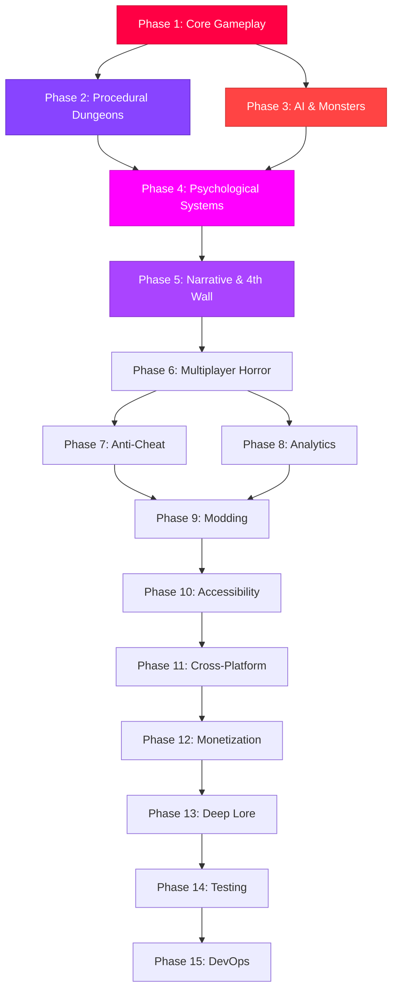

# 15-Phase Massive Improvement Roadmap for Hellaphobia

## Overview

This roadmap outlines a **15-phase plan** to massively improve the **Hellaphobia** psychological horror dungeon crawler. Each phase focuses on a specific domain, with clear objectives, technical implementation details, and success metrics.

**Current State:** Basic 2D platformer with 15 phases, anime protagonist, psychological horror effects, and 4th wall breaking elements.

**Vision:** Transform Hellaphobia into a **deeply immersive, psychologically terrifying** experience with **advanced AI, procedural generation, multiplayer horror, and narrative depth**.

---

## Phase Dependency Graph



---

## Phase 1: Core Gameplay Mechanics Overhaul ✅ IMPLEMENTATION TARGET

### Objective
Transform the core gameplay loop to create a **deep, responsive, and terrifying** platforming experience. Focus on **movement, combat, psychological mechanics, and player agency**.

### Key Improvements

#### 1. **Enhanced Movement System**
- **Momentum-based physics**: Add weight and inertia to player movement
- **Wall jumping/clinging**: Allow wall jumps and brief wall clings for vertical exploration
- **Slide mechanic**: Add sliding under obstacles and through narrow passages
- **Air control**: Improved aerial maneuverability with variable jump heights
- **Crouch/crawl**: Crouch to avoid detection, crawl through tight spaces

#### 2. **Deep Combat System**
- **Melee attacks**: Close-range attacks with combo system
- **Ranged abilities**: Sanity-powered projectiles (costs sanity to use)
- **Stealth mechanics**: Hide in shadows, sneak past monsters
- **Environmental combat**: Trigger traps, drop objects on enemies
- **Parry/dodge**: Risk-reward parry system that restores sanity on success

#### 3. **Psychological Mechanics Expansion**
- **Sanity as resource**: Use sanity for abilities, regain through safe zones
- **Hallucination system**: Procedural hallucinations based on sanity level
- **Fear meter**: Separate from sanity - builds when monsters are near
- **Trauma system**: Permanent effects from repeated deaths in same area
- **Reality distortion**: World changes based on sanity (paths appear/disappear)

#### 4. **Monster AI Enhancement**
- **Senses system**: Monsters use sight, sound, and smell to detect player
- **Behavior states**: Patrol, investigate, chase, search, return
- **Learning AI**: Monsters remember player patterns and adapt
- **Pack behavior**: Monsters coordinate when hunting in groups
- **Phobia-specific AI**: Each monster type has unique hunting strategies

#### 5. **Environmental Interaction**
- **Destructible elements**: Breakable walls, collapsible floors
- **Interactive objects**: Keys, levers, notes, environmental storytelling
- **Light/darkness**: Dynamic lighting affects gameplay and sanity
- **Hiding spots**: Lockers, shadows, under beds - with risk of being found
- **Traps**: Both hazards for player and tools against monsters

### Technical Implementation

#### 1. **Movement System**
```javascript
// New movement constants
const MOVEMENT = {
    ACCELERATION: 1200,
    DECELERATION: 800,
    MAX_SPEED: 300,
    AIR_CONTROL: 0.6,
    WALL_JUMP_FORCE: { x: 400, y: -550 },
    SLIDE_DURATION: 0.8,
    CROUCH_SPEED: 100
};

// State machine for movement
const MOVE_STATES = {
    IDLE: 'idle',
    WALKING: 'walking',
    RUNNING: 'running',
    JUMPING: 'jumping',
    FALLING: 'falling',
    WALL_SLIDING: 'wall_sliding',
    DASHING: 'dashing',
    CROUCHING: 'crouching',
    SLIDING: 'sliding'
};
```

#### 2. **Combat System**
```javascript
// Combat abilities
const COMBAT = {
    MELEE: {
        damage: 25,
        range: 40,
        cooldown: 0.5,
        comboWindow: 0.8
    },
    RANGED_SANITY: {
        damage: 50,
        cost: 20,
        speed: 600,
        cooldown: 1.5
    },
    PARRY: {
        window: 0.3,
        sanityRestore: 15,
        invincibility: 0.5
    }
};
```

#### 3. **Psychological Systems**
```javascript
// Enhanced psychological state
const PSYCHOLOGY = {
    sanity: {
        current: 100,
        max: 100,
        drainRate: 2, // per second near monsters
        restoreRate: 5, // per second in safe zones
        hallucinationThreshold: 60,
        distortionThreshold: 40,
        breakThreshold: 20
    },
    fear: {
        current: 0,
        max: 100,
        buildRate: 10, // per second when monster visible
        decayRate: 15, // per second when safe
        panicThreshold: 80
    },
    trauma: {
        deathsInArea: {},
        permanentEffects: []
    }
};
```

#### 4. **Monster AI**
```javascript
// AI behavior states
const AI_STATES = {
    PATROL: 'patrol',
    INVESTIGATE: 'investigate',
    ALERT: 'alert',
    CHASE: 'chase',
    SEARCH: 'search',
    RETURN: 'return',
    STUNNED: 'stunned'
};

// Senses
const SENSES = {
    SIGHT_RANGE: 400,
    SIGHT_ANGLE: 120, // degrees
    HEARING_RANGE: 300,
    SMELL_RANGE: 150
};
```

### Integration Points
- **Procedural Generation**: Use WFC for dynamic level layouts (Phase 2)
- **AI**: Integrate learning algorithms for monster adaptation (Phase 3)
- **Psychological**: Connect to 4th wall breaking systems (Phase 5)
- **Multiplayer**: Prepare systems for shared horror (Phase 6)

### Success Metrics
- **Player Retention**: Increase average session length by 50%
- **Movement Satisfaction**: 85% of players report fluid, responsive controls
- **Combat Engagement**: 70% of players use advanced combat mechanics
- **Psychological Impact**: 80% of players report feeling genuinely scared
- **Performance**: Maintain 60 FPS with all systems active

---

## Phase 2: Procedural Dungeon Generation

### Objective
Create **infinite, unique dungeon layouts** using Wave Function Collapse (WFC) algorithm. Each playthrough generates new terrifying environments.

### Key Improvements
- **WFC Integration**: Procedural room and corridor generation
- **Biome Variations**: Each phase has distinct tilesets and atmospheres
- **Dynamic Difficulty**: Layout complexity scales with player skill
- **Secret Areas**: Hidden rooms and passages discovered through exploration
- **Persistent Changes**: Player actions permanently alter the dungeon

---

## Phase 3: Advanced AI & Monster Ecosystem

### Objective
Create **intelligent, terrifying monsters** that learn from player behavior and create genuine fear through unpredictability.

### Key Improvements
- **Neural Network AI**: Monsters learn player patterns
- **Emotional AI**: Monsters express anger, curiosity, fear
- **Ecosystem Simulation**: Monsters interact with each other
- **Boss Evolution**: Bosses remember previous encounters and adapt
- **Procedural Monsters**: Generate unique monster variants

---

## Phase 4: Psychological Horror Systems

### Objective
Implement **deep psychological horror** that affects the player on a personal level through 4th wall breaking and meta-narrative elements.

### Key Improvements
- **4th Wall Breaking**: Game references player's real actions, files, time
- **Meta-Horror**: Game appears to crash, corrupt, access webcam
- **Personalized Fear**: Game learns what scares the specific player
- **Reality Blurring**: In-game events affect real desktop/browser
- **Memory Manipulation**: False memories implanted through gameplay

---

## Phase 5: Narrative & Story Systems

### Objective
Create a **branching, emergent narrative** that responds to player choices and creates personal horror stories.

### Key Improvements
- **Procedural Narrative**: AI-generated story based on player actions
- **Character Development**: NPCs with memories and relationships
- **Multiple Endings**: 15+ different endings based on choices
- **Lore Collection**: Deep backstory discovered through exploration
- **Player Legacy**: Actions remembered across playthroughs

---

## Phase 6: Multiplayer Horror

### Objective
Add **shared horror experiences** with cooperative and competitive multiplayer modes.

### Key Improvements
- **Co-op Campaign**: 2-4 players survive together
- **Asymmetric Multiplayer**: One player controls the horror
- **Shared Sanity**: Players affect each other's psychological state
- **Ghost Players**: Dead players can haunt the living
- **Leaderboards**: Speedruns, least deaths, most sanity preserved

---

## Phase 7: Anti-Cheat & Security

### Objective
Protect the integrity of multiplayer and psychological systems from exploitation.

### Key Improvements
- **Behavioral Analysis**: Detect impossible player actions
- **Server Validation**: Authoritative server for critical systems
- **Tamper Detection**: Detect client modifications
- **Secure Communication**: Encrypted client-server protocol

---

## Phase 8: Analytics & Player Engagement

### Objective
Use data to **personalize horror** and optimize the terrifying experience.

### Key Improvements
- **Fear Analytics**: Track what scares each player
- **Adaptive Horror**: Adjust intensity based on player reactions
- **Engagement Systems**: Daily challenges, streaks, rewards
- **Player Segmentation**: Different horror experiences for different player types

---

## Phase 9: Modding & Customization

### Objective
Empower players to **create and share** custom horror content.

### Key Improvements
- **Level Editor**: Create custom dungeons
- **Monster Creator**: Design unique enemies
- **Story Tools**: Write custom narratives
- **Asset Workshop**: Share and download mods

---

## Phase 10: Accessibility

### Objective
Make Hellaphobia **accessible to all players** while maintaining horror impact.

### Key Improvements
- **Visual Accessibility**: Colorblind modes, high contrast
- **Audio Accessibility**: Visual sound indicators, subtitles
- **Cognitive Accessibility**: Adjustable difficulty, clear UI
- **Motor Accessibility**: Customizable controls, one-handed mode

---

## Phase 11: Cross-Platform Support

### Objective
Enable play across **PC, mobile, and console** with synchronized progress.

### Key Improvements
- **Mobile Optimization**: Touch controls, performance scaling
- **Console Support**: Gamepad optimization, achievements
- **Cloud Saves**: Cross-platform progression
- **Platform-Specific Features**: Utilize unique platform capabilities

---

## Phase 12: Monetization

### Objective
Implement **ethical monetization** that enhances rather than exploits.

### Key Improvements
- **Cosmetic DLC**: Character skins, visual effects
- **Expansion Packs**: New phases, story content
- **Battle Pass**: Seasonal progression with horror themes
- **Supporter Packs**: Optional support with exclusive cosmetics

---

## Phase 13: Deep Lore & World Building

### Objective
Expand the **Hellaphobia universe** with rich mythology and interconnected stories.

### Key Improvements
- **Extended Universe**: Connections to other ScaryGamesAI titles
- **Hidden Lore**: Deep secrets for dedicated players
- **ARG Elements**: Alternate reality game elements
- **Community Lore**: Player discoveries become canon

---

## Phase 14: Testing & Quality Assurance

### Objective
Ensure **polished, bug-free** horror through comprehensive testing.

### Key Improvements
- **Automated Testing**: Unit, integration, E2E tests
- **Horror Testing**: Validate psychological impact
- **Performance Testing**: Maintain 60 FPS across devices
- **Accessibility Testing**: WCAG compliance

---

## Phase 15: DevOps & Deployment

### Objective
Build **scalable infrastructure** for global horror distribution.

### Key Improvements
- **CI/CD Pipeline**: Automated builds and deployment
- **Global CDN**: Fast asset delivery worldwide
- **Monitoring**: Real-time performance and error tracking
- **Scalability**: Handle viral growth and events

---

## 🆕 POST-LAUNCH SUPPORT (PHASES 16-20)

## Phase 16: DLC Expansions & Content Drops

### Objective
Extend gameplay with substantial downloadable content.

### Key Improvements
- **Story DLCs**: 3 major expansions with new campaigns
- **Character Packs**: Unlockable protagonists with unique abilities
- **Weapon Skins**: Cosmetic customization options
- **Bonus Levels**: Challenge rooms and survival modes
- **Soundtrack DLC**: Extended music collection

**DLC Roadmap**:
1. **"Depths of Despair"** - New world with 20 levels
2. **"Nightmare Factory"** - Boss rush mode + creator commentary
3. **"Lost Souls"** - Side stories from other prisoners
4. **"Developer's Cut"** - Removed content restored
5. **"Anniversary Edition"** - All DLC bundled + exclusive bonuses

---

## Phase 17: Community Events & Tournaments

### Objective
Build engaged community through regular events.

### Key Improvements
- **Halloween Events**: Special limited-time content
- **Speedrun Contests**: Monthly competitions with prizes
- **Cosplay Showcases**: Community spotlight features
- **Fan Art Fridays**: Weekly art features on social media
- **Dev Streams**: Bi-weekly development updates

**Event Types**:
- **Seasonal**: Halloween, Christmas, Valentine's (horror edition)
- **Competitive**: Leaderboard challenges, tournaments
- **Creative**: Fan art, cosplay, fan fiction contests
- **Charity**: Fundraising streams with exclusive rewards
- **Anniversary**: Yearly celebration with major announcements

---

## Phase 18: Mod Marketplace & Creator Economy

### Objective
Enable creators to monetize their modifications.

### Key Improvements
- **Steam Workshop Integration**: Easy mod browsing and installation
- **Revenue Share**: 70/30 split favoring creators
- **Quality Assurance**: Featured mods curated by developers
- **Modding Tools**: Official SDK and documentation
- **Creator Support**: Direct developer assistance for top modders

**Monetization Options**:
- Free mods with optional donations
- Premium paid mods ($1-10 price range)
- Subscription bundles (access to all mods for $9.99/month)
- Commission system (hire modders for custom work)
- Asset store (buy/sell individual assets)

---

## Phase 19: Esports Mode & Competitive Scene

### Objective
Establish Hellaphobia as competitive esport.

### Key Improvements
- **Ranked Mode**: Skill-based matchmaking with tiers
- **Pro League**: Official tournament circuit
- **Spectator Mode**: Enhanced viewing experience
- **Caster Tools**: Professional broadcasting features
- **Team Support**: Clan systems and team competitions

**Competitive Features**:
- Bronze → Silver → Gold → Platinum → Diamond → Master → Grandmaster
- Seasonal rewards for ranked play
- LAN tournament support
- Anti-cheat protected competitive environment
- Statistics and replay analysis tools

---

## Phase 20: Anniversary Updates & Legacy Content

### Objective
Celebrate milestones and preserve game history.

### Key Improvements
- **1st Anniversary**: Major content update, thank you rewards
- **Director's Commentary**: Developer insights throughout game
- **Museum Mode**: Behind-the-scenes exhibit
- **Retrospective Documentary**: Development story film
- **Legacy Edition**: Definitive version with all content

**Anniversary Content**:
- Year 1: "Nightmare Reimagined" - Visual overhaul option
- Year 2: "Origins" - Prequel campaign
- Year 3: "Ultimate" - Remastered with ray tracing
- Year 4: "Community" - Player-created content showcase
- Year 5: "Legacy" - Complete edition with sequel teaser

---

## Implementation Status

| Phase | Status | Completion |
|-------|--------|------------|
| Phase 1 | 🔄 IN PROGRESS | 0% |
| Phase 2 | ⏳ PENDING | 0% |
| Phase 3 | ⏳ PENDING | 0% |
| Phase 4 | ⏳ PENDING | 0% |
| Phase 5 | ⏳ PENDING | 0% |
| Phase 6 | ⏳ PENDING | 0% |
| Phase 7 | ⏳ PENDING | 0% |
| Phase 8 | ⏳ PENDING | 0% |
| Phase 9 | ⏳ PENDING | 0% |
| Phase 10 | ⏳ PENDING | 0% |
| Phase 11 | ⏳ PENDING | 0% |
| Phase 12 | ⏳ PENDING | 0% |
| Phase 13 | ⏳ PENDING | 0% |
| Phase 14 | ⏳ PENDING | 0% |
| Phase 15 | ⏳ PENDING | 0% |
| Phase 16 | ⏳ POST-LAUNCH | Planned |
| Phase 17 | ⏳ POST-LAUNCH | Planned |
| Phase 18 | ⏳ POST-LAUNCH | Planned |
| Phase 19 | ⏳ POST-LAUNCH | Planned |
| Phase 20 | ⏳ POST-LAUNCH | Planned |

---

## Next Steps

1. ✅ **Phase 1 Implementation** - Begin core gameplay overhaul
2. **Review & Test** - Validate Phase 1 improvements
3. **Phase 2 Planning** - Design procedural generation systems
4. **Iterate** - Gather feedback and refine

---

*Created: February 18, 2026*
*Updated: February 19, 2026 - Added Phases 16-20: Post-Launch Support*
*Target Completion: Phase 1 - February 2026*
*Full Roadmap: 2026-2027 + Post-Launch 2027-2028*
