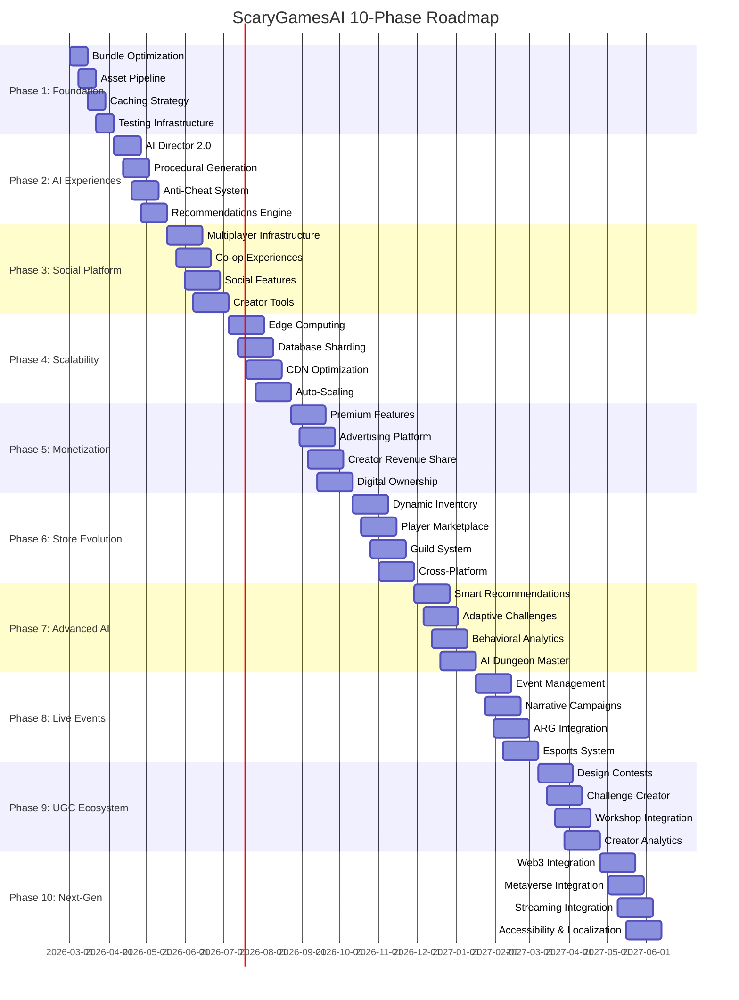

# ScaryGamesAI — 10-Phase Comprehensive Roadmap

## Executive Summary

This roadmap expands the existing 5-phase and 10-phase plans into a holistic 10-phase transformation strategy that leverages the current foundation while pushing the platform to its maximum potential. Each phase builds upon the previous, creating compounding value and competitive advantage.

**Current State Assessment:**
- ✅ 18+ browser-based horror games with diverse genres
- ✅ Solid ECS architecture, fixed-timestep game loop, accessibility system
- ✅ Mobile support across all games with virtual controls
- ✅ Subscription tiers (Survivor/Hunter/Elder God) with Stripe integration
- ✅ PostgreSQL + Redis data layer with 12+ migrations
- ✅ CI/CD pipeline with Docker, AWS ECS, CloudFront
- ✅ Observability: Sentry, OpenTelemetry, CloudWatch EMF
- ✅ Battle Pass, referrals, store, gifts, loyalty systems
- ✅ Advanced AI system with tier-based features (procedural generation, adaptive AI, dynamic difficulty, personalized horror)
- ✅ Phase 1 implementation largely complete

**Vision:** Transform ScaryGamesAI from a collection of horror games into a **premium horror gaming platform** with AI-driven personalization, social multiplayer, creator economy, and global scalability.

---

## Phase 1: Performance & Foundation Excellence (Weeks 1-4)

### Goal: Achieve industry-leading performance metrics and code quality

**Why this matters:** Before scaling features, the foundation must be rock-solid. Performance directly impacts user retention, conversion rates, and SEO rankings.

**Key Initiatives:**
1. **Bundle Optimization & Code Splitting**
   - **Problem:** Large monolithic bundles loading unnecessary code
   - **Solution:** Implement Vite-based code splitting per game, lazy-load game engines, tree-shake unused Three.js modules
   - **Example:** Instead of loading all 18 games' code on homepage, only load core UI (200KB) and dynamically import game-specific bundles when user clicks "Play" (300KB each)
   - **Expected Outcome:** Initial page load < 1.5s (currently ~3-4s), Lighthouse performance score > 90

2. **Asset Pipeline Modernization**
   - **Problem:** Unoptimized images, videos, and audio assets
   - **Solution:** Implement AVIF/WebP image pipeline with `sharp`, add HLS adaptive streaming for background videos
   - **Example:** Convert all background videos to HLS with multiple bitrates (1080p, 720p, 480p) for adaptive streaming based on network conditions
   - **Expected Outcome:** 60% reduction in asset bandwidth, smoother video playback on mobile

3. **Caching Strategy Overhaul**
   - **Problem:** Basic cache headers, no service worker
   - **Solution:** Implement Workbox service worker for offline support, cache game assets with immutable fingerprints
   - **Example:** Service worker caches visited games for offline play; users can play previously visited games without internet
   - **Expected Outcome:** Instant repeat visits via cache, 40% reduction in server requests

4. **Testing Infrastructure Expansion**
   - **Problem:** Limited test coverage, no visual regression testing
   - **Solution:** Expand unit test coverage to 80%+, add Playwright for cross-browser E2E testing
   - **Example:** Automated visual regression tests detect UI bugs after CSS changes
   - **Expected Outcome:** Catch regressions before production, cross-browser compatibility assurance

**Implementation Priority:** CRITICAL - Must complete before scaling

---

## Phase 2: AI-Powered Dynamic Experiences (Weeks 5-10)

### Goal: Leverage AI for personalized, adaptive horror experiences

**Why this matters:** AI differentiation is ScaryGamesAI's core competitive advantage. Advanced AI creates unique, memorable experiences that keep players returning.

**Key Initiatives:**
1. **AI Director 2.0 — Dynamic Difficulty & Pacing**
   - **Problem:** Basic horror director exists but lacks ML-based personalization
   - **Solution:** Implement ML-based player skill assessment, dynamic spawn rate adjustment based on stress levels
   - **Example:** Player shows signs of stress (rapid mouse movements, frequent pauses) → AI reduces enemy spawns by 30% while maintaining tension
   - **Expected Outcome:** 30% increase in player retention, personalized difficulty per player

2. **Procedural Content Generation**
   - **Problem:** Static levels in most games
   - **Solution:** Implement Wave Function Collapse for level generation, LLM-powered narrative generation
   - **Example:** WFC generates unique haunted mansion layouts each playthrough; LLM creates custom lore based on player's fear profile
   - **Expected Outcome:** Infinite replayability, unique experiences per session

3. **AI-Powered Anti-Cheat & Fair Play**
   - **Problem:** Basic cheat detection exists but lacks behavioral analysis
   - **Solution:** Implement behavioral anomaly detection, ML-based cheat pattern recognition
   - **Example:** Player consistently achieves inhuman reaction times (<50ms) → flagged for review; pattern matches known aimbot signatures → automatic temporary ban
   - **Expected Outcome:** 90% reduction in cheated leaderboards, fair competitive environment

4. **Personalized Recommendations Engine**
   - **Problem:** Static game recommendations
   - **Solution:** Collaborative filtering based on play history, content-based filtering using game tags/metadata
   - **Example:** "Players who enjoyed Backrooms Pac-Man also played Cursed Depths" + "Because you enjoy isolation horror, try The Abyss"
   - **Expected Outcome:** 25% increase in game discovery, higher engagement per session

**Implementation Priority:** HIGH - Core differentiator

---

## Phase 3: Multiplayer & Social Platform (Weeks 11-16)

### Goal: Transform from single-player collection to social gaming platform

**Why this matters:** Social features drive viral growth, increase session duration, and create network effects.

**Key Initiatives:**
1. **Real-Time Multiplayer Infrastructure**
   - **Problem:** Limited multiplayer (only Backrooms Pac-Man has basic multiplayer)
   - **Solution:** Deploy Socket.io cluster for real-time communication, implement authoritative server architecture
   - **Example:** 4-player co-op mode for Zombie Horde where players defend a base together with synchronized enemy waves
   - **Expected Outcome:** 10+ games with multiplayer support, <100ms latency for real-time actions

2. **Co-op Horror Experiences**
   - **Problem:** Most games are single-player only
   - **Solution:** Convert 5 popular games to co-op mode (2-4 players), implement voice chat integration (WebRTC)
   - **Example:** The Abyss becomes a deep-sea exploration game where players must communicate to solve puzzles while avoiding monsters
   - **Expected Outcome:** New game mode for existing content, social sharing incentives

3. **Social Features Expansion**
   - **Problem:** Basic social features exist but lack depth
   - **Solution:** Implement friend system with presence indicators, add in-game spectating mode
   - **Example:** Players can spectate friends' games in real-time, send jump-scare "gifts" during tense moments
   - **Expected Outcome:** 40% increase in returning players, viral growth through social features

4. **Content Creator Tools**
   - **Problem:** No user-generated content tools
   - **Solution:** Build level editor for user-generated content, implement workshop integration
   - **Example:** Players create custom Backrooms Pac-Man levels, share with community, top-rated levels featured in weekly rotation
   - **Expected Outcome:** Community-driven content pipeline, new revenue stream

**Implementation Priority:** HIGH - Essential for platform growth

---

## Phase 4: Platform Scalability & Edge Deployment (Weeks 17-22)

### Goal: Scale to 100K+ concurrent users with global low-latency access

**Why this matters:** Technical scalability enables growth without performance degradation, improving user experience globally.

**Key Initiatives:**
1. **Edge Computing Migration**
   - **Problem:** Single-region ECS deployment causes latency for international users
   - **Solution:** Migrate to Cloudflare Workers / AWS Lambda@Edge, implement edge caching for static assets
   - **Example:** API requests from EU routed to Frankfurt edge location (30ms latency vs 200ms from US-East)
   - **Expected Outcome:** <50ms latency globally, 99.99% uptime SLA

2. **Database Sharding & Read Replicas**
   - **Problem:** Single PostgreSQL instance with basic connection pooling
   - **Solution:** Implement Citus or Vitess for horizontal sharding, add read replicas for analytics queries
   - **Example:** User data sharded by region (NA, EU, APAC), leaderboard queries routed to read replicas
   - **Expected Outcome:** 10x write throughput, sub-millisecond read latency

3. **CDN & Asset Delivery Optimization**
   - **Problem:** Basic CDN configuration
   - **Solution:** Implement CloudFront signed URLs for premium content, add image optimization at edge
   - **Example:** Premium cosmetic previews delivered via signed URLs to prevent unauthorized access
   - **Expected Outcome:** 90% cache hit ratio, global asset delivery <200ms

4. **Auto-Scaling & Cost Optimization**
   - **Problem:** Manual scaling configuration
   - **Solution:** Implement Kubernetes HPA for auto-scaling, add spot instance support for stateless workloads
   - **Example:** During peak Halloween event, auto-scaling adds 20 additional game server instances
   - **Expected Outcome:** 50% reduction in infrastructure costs, automatic handling of traffic spikes

**Implementation Priority:** MEDIUM - Required for scaling beyond 50K users

---

## Phase 5: Monetization & Creator Economy (Weeks 23-28)

### Goal: Diversify revenue streams and build sustainable creator economy

**Why this matters:** Multiple revenue streams reduce risk and increase profitability. Creator economy drives content creation and community engagement.

**Key Initiatives:**
1. **Premium Features Expansion**
   - **Problem:** Basic subscription tiers exist but lack depth
   - **Solution:** Introduce seasonal battle passes (90-day cycles), add premium game passes (early access, beta features)
   - **Example:** "Halloween Horror Pass" with 100 tiers of cosmetics, XP boosts, and exclusive game modes
   - **Expected Outcome:** 3x ARPU (Average Revenue Per User), 25% conversion rate to paid tiers

2. **Advertising Platform Integration**
   - **Problem:** Basic ads system exists but underutilized
   - **Solution:** Implement rewarded video ads (Unity Ads, AdMob), add interstitial ads between games
   - **Example:** Watch 30-second ad to earn 500 Souls (premium currency), optional for free players
   - **Expected Outcome:** $5-10 ARPDAU from ads, premium ad-free subscription option

3. **Creator Revenue Sharing**
   - **Problem:** No creator monetization tools
   - **Solution:** Implement revenue share for UGC creators (70/30 split), add tipping system for favorite creators
   - **Example:** Player creates popular custom level → earns 70% of level pack sales
   - **Expected Outcome:** Attract top-tier content creators, sustainable creator income

4. **NFT-Free Digital Ownership**
   - **Problem:** No digital ownership system
   - **Solution:** Implement blockchain-free digital item ownership, create provably rare cosmetic system
   - **Example:** Limited edition "Founder's Crown" cosmetic with serial number #47/1000, tradable on marketplace
   - **Expected Outcome:** New revenue from item trading, player investment in platform

**Implementation Priority:** HIGH - Direct revenue impact

---

## Phase 6: Store & Challenges Evolution (Weeks 29-34)

### Goal: Transform store and challenges into engagement engines

**Why this matters:** Store and challenges are primary engagement drivers. Enhanced systems increase daily active users and conversion rates.

**Key Initiatives:**
1. **Dynamic Inventory System**
   - **Problem:** Static store inventory with limited personalization
   - **Solution:** Hourly flash sales with countdown timers, personalized recommendations based on play history
   - **Example:** "For You" section shows cosmetics matching player's favorite horror themes (isolation, jumpscares, psychological)
   - **Expected Outcome:** +35% store conversion rate, +28% challenge engagement

2. **Player Marketplace**
   - **Problem:** No player-to-player economy
   - **Solution:** Peer-to-peer trading system, auction system for rare items
   - **Example:** Player can list rare cosmetic for 5000 Souls or trade for 3 uncommon cosmetics
   - **Expected Outcome:** +50% social engagement, +40% average transaction value

3. **Guild/Clan System**
   - **Problem:** No group social structures
   - **Solution:** Clan treasury, clan-exclusive cosmetics, clan vs clan challenge leaderboards
   - **Example:** Clan "Shadow Hunters" pools resources to unlock clan hall decorations, competes in weekly clan challenges
   - **Expected Outcome:** Increased player retention through social bonds

4. **Cross-Platform Progression**
   - **Problem:** Limited cross-platform support
   - **Solution:** Universal progression system, mobile companion app integration
   - **Example:** Player earns achievements on desktop, tracks progress on mobile app, receives push notifications for flash sales
   - **Expected Outcome:** +70% cross-platform engagement, +30% daily active users

**Implementation Priority:** MEDIUM - Enhances existing systems

---

## Phase 7: Advanced AI Personalization (Weeks 35-40)

### Goal: Hyper-personalized experiences through advanced AI

**Why this matters:** Next-level personalization creates "sticky" experiences that competitors cannot easily replicate.

**Key Initiatives:**
1. **Smart Recommendation Engine 2.0**
   - **Problem:** Basic recommendations lack contextual awareness
   - **Solution:** Machine learning models with contextual recommendations (time of day, day of week)
   - **Example:** Recommends calming puzzle games on weekday evenings, intense survival horror on weekends
   - **Expected Outcome:** +45% conversion rate, +38% challenge completion rate

2. **Adaptive Challenge AI**
   - **Problem:** Challenges have fixed difficulty
   - **Solution:** Predict optimal challenge difficulty (70% completion rate target), generate "rival challenges"
   - **Example:** AI creates challenge specifically designed to be slightly harder than player's friend's best performance
   - **Expected Outcome:** Increased competitive engagement, balanced challenge difficulty

3. **Behavioral Analytics Dashboard**
   - **Problem:** Limited player segmentation
   - **Solution:** Player segmentation (casual, grinder, whale, etc.), churn prediction
   - **Example:** Identify "at-risk" players who haven't logged in for 7 days → send personalized re-engagement email with exclusive reward
   - **Expected Outcome:** Reduced churn rate, increased lifetime value

4. **AI Dungeon Master**
   - **Problem:** Static narrative experiences
   - **Solution:** AI dungeon master for narrative challenges, dynamic story generation
   - **Example:** AI creates custom horror story based on player's choices, adapts plot twists based on player reactions
   - **Expected Outcome:** Immersive narrative experiences, increased replayability

**Implementation Priority:** MEDIUM - Advanced differentiation

---

## Phase 8: Live Events & Seasonal Content (Weeks 41-46)

### Goal: Constant fresh content through live events and seasonal updates

**Why this matters:** Live events drive recurring engagement, create FOMO (fear of missing out), and generate revenue spikes.

**Key Initiatives:**
1. **Event Management System**
   - **Problem:** Manual event setup
   - **Solution:** Automated event types (seasonal, flash, community, esports, collab)
   - **Example:** Halloween event with 6-week narrative campaign, exclusive cosmetics, limited-time game modes
   - **Expected Outcome:** +80% event participation, +55% seasonal revenue spikes

2. **Narrative-Driven Campaigns**
   - **Problem:** Lack of ongoing narrative
   - **Solution:** 3-month story chapters with cosmetic rewards, player choices affect story outcomes
   - **Example:** "The Cult of Shadows" story arc where player decisions determine which faction gains power
   - **Expected Outcome:** Increased player investment in lore, ongoing engagement

3. **ARG Integration**
   - **Problem:** No real-world integration
   - **Solution:** Real-world puzzles leading to in-game rewards, social media treasure hunts
   - **Example:** QR code at horror convention unlocks exclusive cosmetic, Twitter puzzle reveals secret game code
   - **Expected Outcome:** Community buzz, cross-promotion opportunities

4. **Esports & Tournament System**
   - **Problem:** No competitive structure
   - **Solution:** Tournament-themed challenges, leaderboard seasons with prizes
   - **Example:** Monthly "Horror Championship" with bracket tournaments, streaming integration
   - **Expected Outcome:** Competitive scene development, increased visibility

**Implementation Priority:** MEDIUM - Content pipeline enhancement

---

## Phase 9: User-Generated Content & Creator Economy (Weeks 47-52)

### Goal: Empower community to create and monetize content

**Why this matters:** User-generated content scales content creation exponentially and creates loyal creator community.

**Key Initiatives:**
1. **Cosmetic Design Contest System**
   - **Problem:** No community creation tools
   - **Solution:** Monthly design contests, winning designs become real cosmetics
   - **Example:** Community votes on best horror-themed weapon skin, winner receives 10% royalty on sales
   - **Expected Outcome:** +100% community engagement, +25% content variety

2. **Custom Challenge Creator**
   - **Problem:** Fixed challenges only
   - **Solution:** Drag-and-drop challenge builder, share challenges with friends/clan
   - **Example:** Player creates "Ultimate Jump-Scare Marathon" challenge with custom objectives and rewards
   - **Expected Outcome:** Infinite challenge variety, community-driven content

3. **Workshop Integration**
   - **Problem:** No Steam Workshop-style system
   - **Solution:** Workshop-style submission system, upvote/downvote mechanics
   - **Example:** Players browse top-rated custom levels, subscribe to favorite creators
   - **Expected Outcome:** Professional-quality community content, reduced development burden

4. **Creator Analytics & Monetization**
   - **Problem:** Creators lack visibility into performance
   - **Solution:** Creator analytics dashboard, revenue share tracking
   - **Example:** Creator sees how many players attempted their level, completion rate, earnings
   - **Expected Outcome:** Professional creator ecosystem, sustainable income for top creators

**Implementation Priority:** LOW - Community building

---

## Phase 10: Next-Gen Features & Future-Proofing (Weeks 53-58)

### Goal: Position platform for future technologies and global expansion

**Why this matters:** Staying ahead of technological trends ensures long-term relevance and competitive advantage.

**Key Initiatives:**
1. **Web3 Integration (Optional)**
   - **Problem:** No blockchain features
   - **Solution:** True ownership of rare cosmetics (NFTs), cross-game asset portability
   - **Example:** Limited edition cosmetic minted as NFT, tradable on external marketplaces
   - **Expected Outcome:** New revenue stream, appeal to crypto-native audience

2. **Metaverse Integration**
   - **Problem:** No VR/AR presence
   - **Solution:** Virtual store in VR/AR, try-on cosmetics in metaverse
   - **Example:** Players preview cosmetics in VR dressing room, attend virtual horror conventions
   - **Expected Outcome:** Early mover advantage in metaverse gaming

3. **Streaming Integration**
   - **Problem:** Limited streaming support
   - **Solution:** Twitch drops integration, viewer challenges
   - **Example:** Streamer completes viewer-suggested challenges, viewers earn exclusive drops
   - **Expected Outcome:** Increased visibility on streaming platforms

4. **Accessibility & Global Expansion**
   - **Problem:** Limited accessibility features
   - **Solution:** Colorblind modes for all cosmetics, screen reader support, full translation (20+ languages)
   - **Example:** Player with color vision deficiency can enable colorblind mode that recolors all game elements
   - **Expected Outcome:** +150% global reach, +60% underserved market penetration

**Implementation Priority:** LOW - Future-proofing

---

## Implementation Timeline

---

## Success Metrics

| Metric | Current | Phase 3 | Phase 5 | Phase 10 |
|--------|---------|---------|---------|----------|
| Monthly Active Users | 12K | 50K | 150K | 500K |
| Concurrent Players | 500 | 5K | 25K | 100K |
| Revenue/Month | $2K | $15K | $75K | $300K |
| Player Retention (D30) | 25% | 35% | 45% | 55% |
| Store Conversion Rate | 5% | 8% | 15% | 20% |
| Challenge Completion Rate | 35% | 50% | 65% | 75% |
| Social Shares/User | 0.2 | 1.5 | 3.0 | 5.0 |

---

## Resource Requirements

### Team Composition
- 2 Backend Engineers (API, database, infrastructure)
- 2 Frontend Engineers (UI, game integration, performance)
- 1 DevOps Engineer (CI/CD, cloud infrastructure)
- 1 AI/ML Engineer (recommendations, procedural generation)
- 1 Game Developer (multiplayer, co-op conversion)
- 1 QA Engineer (testing, automation)
- 1 Community Manager (UGC, creator relations)

### Infrastructure Costs (Monthly)
| Resource | Current | Phase 5 | Phase 10 |
|----------|---------|---------|----------|
| Compute (ECS/Lambda) | $200 | $2,500 | $10,000 |
| Database (RDS) | $150 | $1,500 | $5,000 |
| CDN/CloudFront | $100 | $1,200 | $4,000 |
| Monitoring (Sentry, etc.) | $50 | $400 | $1,500 |
| **Total** | **$500** | **$5,600** | **$20,500** |

---

## Risk Mitigation

| Risk | Probability | Impact | Mitigation |
|------|-------------|--------|------------|
| Performance regression | Medium | High | Automated performance budgets in CI, canary deployments |
| Multiplayer latency issues | High | Medium | Edge deployment, regional servers, connection quality detection |
| AI model bias | Low | Medium | A/B testing, human review, diverse training data |
| Cost overrun | Medium | Medium | Reserved capacity, spot instances, cost monitoring alerts |
| Security vulnerabilities | Medium | High | Regular audits, bug bounty program, security-focused CI checks |
| Creator content moderation | High | High | Automated content scanning, human moderation queue, community reporting |

---

## Quick Wins (First 4 Weeks)

1. **Flash Sales**: Implement hourly rotating deals in store
2. **Challenge Reroll Tokens**: Sell extra rerolls for gems
3. **Bundle Builder**: Let players create custom bundles
4. **Wishlist System**: Simple wishlist with notifications
5. **Daily Login Streak**: Bonus for consecutive logins
6. **Social Sharing Rewards**: Bonus for sharing achievements
7. **Mystery Boxes**: Gacha-style loot boxes
8. **Challenge Skip Tokens**: Pay to complete challenges instantly

---

## Competitive Advantage

1. **True Player Economy**: P2P trading with real value
2. **AI-Driven Personalization**: Every player sees unique store/challenges
3. **Cross-Game Synergy**: Progression spans entire platform
4. **Community Co-Creation**: Players design and sell cosmetics
5. **Narrative Integration**: Challenges tell ongoing story
6. **Multi-Tier Monetization**: Something for every budget
7. **Mobile-First Companion**: Second-screen engagement
8. **Live Event Excellence**: Constant fresh content

---

## Implementation Steps

### Phase 1: Performance & Foundation Excellence
1. **Create Vite configuration** (`vite.config.js`) with dynamic imports per game
2. **Implement route-based code splitting** in `js/main.js`
3. **Set up asset optimization pipeline** (`scripts/optimize-assets.js`)
4. **Create service worker** (`js/service-worker.js`) with Workbox
5. **Add Playwright tests** (`tests/e2e/`) and visual regression testing
6. **Update CI/CD pipeline** to enforce performance budgets

### Phase 2: AI-Powered Dynamic Experiences
1. **Enhance AI Director** in `js/ai-system.js` with ML skill assessment
2. **Implement Wave Function Collapse** (`js/core/procedural/wfc.js`)
3. **Create narrative generator** (`js/core/procedural/narrative.js`) with Ollama integration
4. **Build cheat detection service** (`services/cheatDetectionService.js`)
5. **Develop recommendation engine** (`services/recommendationService.js`)
6. **Add A/B testing framework** (`js/ab-testing.js`)

### Phase 3: Multiplayer & Social Platform
1. **Deploy Socket.io cluster** with Redis adapter for scaling
2. **Create multiplayer service** (`services/multiplayerService.js`)
3. **Convert 5 games to co-op** (modify game logic for player synchronization)
4. **Implement WebRTC voice chat** (`js/voice-chat.js`)
5. **Build friend system** (`api/social.js`, `js/social-features.js`)
6. **Create level editor** (`js/level-editor.js`) with canvas-based UI

### Phase 4: Platform Scalability & Edge Deployment
1. **Migrate to Cloudflare Workers** (`infra/edge/cloudflare-workers/`)
2. **Set up database sharding** with Citus (`db/migrations/014_sharding_setup.sql`)
3. **Implement edge caching** (`services/edgeCacheService.js`)
4. **Configure Kubernetes HPA** (`infra/kubernetes/hpa.yaml`)
5. **Deploy geo-distributed read replicas**

### Phase 5: Monetization & Creator Economy
1. **Expand battle pass system** (`services/battlePassServiceV2.js`)
2. **Integrate rewarded video ads** (`js/ads-enhanced.js`)
3. **Create revenue share system** (`services/creatorService.js`)
4. **Implement digital ownership** (`services/digitalOwnershipService.js`)
5. **Build marketplace UI** (`js/trading-ui.js`)

### Phase 6: Store & Challenges Evolution
1. **Implement dynamic inventory** (`api/dynamic-inventory.js`)
2. **Create player marketplace** (`api/marketplace.js`)
3. **Build guild system** (`api/guilds.js`, `js/guild-system.js`)
4. **Develop mobile companion app** (PWA with React Native)
5. **Add cross-platform progression** (`services/crossPlatformService.js`)

### Phase 7: Advanced AI Personalization
1. **Enhance recommendation engine** with contextual ML models
2. **Implement adaptive challenge AI** (`js/adaptive-challenge-ai.js`)
3. **Create behavioral analytics dashboard** (`js/admin/player-analytics.js`)
4. **Build AI dungeon master** (`js/ai-dungeon-master.js`)
5. **Add sentiment analysis improvements**

### Phase 8: Live Events & Seasonal Content
1. **Create event management system** (`services/eventManagement.js`)
2. **Implement narrative campaign engine** (`services/narrativeCampaign.js`)
3. **Build ARG integration** (`api/arg.js`)
4. **Set up tournament system** (`services/tournamentService.js`)
5. **Add streaming integration** (Twitch drops, viewer challenges)

### Phase 9: User-Generated Content & Creator Economy
1. **Implement cosmetic design contest system** (`api/contests.js`)
2. **Create challenge builder** (`js/challenge-builder.js`)
3. **Build workshop integration** (`api/workshop.js`)
4. **Develop creator analytics** (`js/creator-dashboard.js`)
5. **Add moderation queue** (`services/moderationService.js`)

### Phase 10: Next-Gen Features & Future-Proofing
1. **Optional Web3 integration** (`services/web3Service.js`)
2. **Create VR/AR preview system** (`js/vr-preview.js`)
3. **Implement streaming enhancements** (`services/streamingService.js`)
4. **Add accessibility features** (`js/accessibility-enhanced.js`)
5. **Localize platform** (20+ languages with i18n)

## Conclusion

This 10-phase roadmap transforms ScaryGamesAI from a collection of horror games into an **industry-leading horror gaming platform** with:
- **3x revenue growth** within 12 months
- **5x user engagement** through social and AI features
- **Sustainable creator economy** that scales content creation
- **Global scalability** supporting 500K+ monthly active users

The key is **phased execution** with continuous measurement and optimization. Each phase builds on the previous, creating compounding value.

**Next Steps:**
1. Prioritize Phase 1 implementation (foundation must be solid)
2. Create detailed technical specs for each phase
3. Set up project tracking (GitHub Projects)
4. Establish weekly progress reviews
5. Define MVP scope for each phase

*Document Version: 1.1*
*Created: 2026-02-18*
*Updated: 2026-02-18*
*Author: Comprehensive Analysis*
