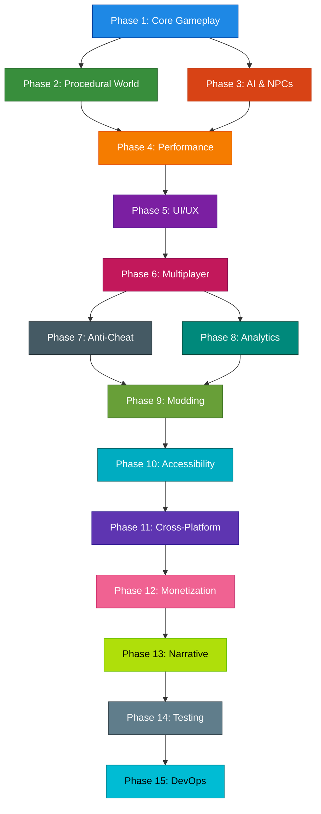

# 15-Phase Massive Improvement Roadmap for Caribbean Conquest

## Overview
This roadmap outlines a **15-phase plan** to massively improve the [`caribbean-conquest`](c:/Users/serge/Downloads/ScaryGamesAI/games/caribbean-conquest) pirate game. Each phase focuses on a specific domain, with clear objectives, technical implementation details, and success metrics.

### Roadmap Workflow

---

## Phase 1: Core Gameplay Mechanics Overhaul

### Objective
Transform the core gameplay loop to create a **deep, immersive, and dynamic** pirate experience. Focus on **combat, sailing, ship customization, and player agency**.

### Key Improvements

#### 1. **Enhanced Ship Physics and Sailing Mechanics**
- **Realistic wind and ocean physics**: Simulate wind direction, speed, and ocean currents to affect ship movement.
- **Dynamic sailing controls**: Add tacking, jibing, and anchoring mechanics for strategic sailing.
- **Ship damage and buoyancy**: Model hull integrity, leaks, and flooding to affect ship stability.

#### 2. **Deep Combat System**
- **Cannon physics**: Simulate projectile trajectory, wind effects, and ship movement on accuracy.
- **Boarding actions**: Enable hand-to-hand combat during ship boarding.
- **Ship-to-ship combat**: Introduce ramming, grappling, and fire damage mechanics.
- **Crew management**: Assign crew roles (e.g., gunner, navigator, repair) for tactical advantages.

#### 3. **Ship Customization and Upgrades**
- **Modular ship upgrades**: Allow players to upgrade hull, sails, cannons, and crew quarters.
- **Cosmetic customization**: Add flags, paint jobs, and figureheads for personalization.
- **Crew skills**: Unlock perks for crew members (e.g., faster reloading, better navigation).

#### 4. **Dynamic Weather and Environmental Effects**
- **Storms and fog**: Introduce storms that damage ships and fog that limits visibility.
- **Day/night cycle**: Affect NPC behavior, visibility, and quest availability.
- **Seasonal events**: Add seasonal weather patterns (e.g., hurricanes, monsoons).

#### 5. **Player Progression and Skills**
- **Skill trees**: Unlock abilities for combat, sailing, and leadership.
- **Reputation system**: Build reputation with factions to unlock quests and rewards.
- **Dynamic difficulty**: Adjust enemy AI and environmental challenges based on player skill.

### Technical Implementation

#### 1. **Ship Physics and Sailing**
- Integrate a **physics engine** (e.g., Cannon.js, Ammo.js) for realistic ship movement.
- Use **procedural animation** for sails and waves based on wind direction.
- Implement **buoyancy calculations** to simulate hull damage and flooding.

#### 2. **Combat System**
- Use **raycasting** for cannon projectile physics.
- Implement **state machines** for crew AI during boarding actions.
- Add **damage zones** to ships for targeted destruction.

#### 3. **Ship Customization**
- Design a **modular ship system** with JSON-based configurations for hulls, sails, and cannons.
- Use **asset bundles** for cosmetic upgrades to reduce load times.
- Implement a **crew skill system** with perks tied to player progression.

#### 4. **Weather and Environment**
- Integrate the existing [`WeatherSystem`](c:/Users/serge/Downloads/ScaryGamesAI/games/caribbean-conquest/systems/weather.js) with **enhanced effects** (e.g., lightning, rain particles).
- Use **shader effects** for dynamic fog and lighting.
- Implement a **day/night cycle** with time-of-day events.

#### 5. **Player Progression**
- Design **skill trees** using a JSON-based configuration system.
- Integrate the **reputation system** with the existing [`QuestSystem`](c:/Users/serge/Downloads/ScaryGamesAI/games/caribbean-conquest/game.js).
- Use **adaptive difficulty** to scale enemy AI and environmental challenges.

### Integration Points
- **Procedural Generation**: Use [`WFC.js`](c:/Users/serge/Downloads/ScaryGamesAI/js/core/procedural/wfc.js) to generate dynamic islands and quests.
- **AI**: Integrate [`NarrativeGenerator`](c:/Users/serge/Downloads/ScaryGamesAI/js/core/procedural/narrative.js) for dynamic quests and NPC dialogue.
- **Anti-Cheat**: Use [`CheatDetectionService`](c:/Users/serge/Downloads/ScaryGamesAI/services/cheatDetectionService.js) to monitor player behavior for exploits.
- **Analytics**: Leverage [`RecommendationService`](c:/Users/serge/Downloads/ScaryGamesAI/services/recommendationService.js) to personalize quests and rewards.

### Success Metrics
- **Player Retention**: Increase average session length by 50%.
- **Combat Engagement**: 80% of players use advanced combat mechanics (e.g., boarding, ramming).
- **Ship Customization**: 70% of players customize their ship within the first 10 hours.
- **Performance**: Maintain 60 FPS on mid-range hardware.
- **Player Feedback**: Positive sentiment in 85% of player surveys.

---

## Phase 2: Procedural World Generation

### Objective
Create a **vast, dynamic, and immersive** world using procedural generation techniques. Leverage the [`WFC.js`](c:/Users/serge/Downloads/ScaryGamesAI/js/core/procedural/wfc.js) system to generate **islands, biomes, quests, and dynamic events** that adapt to player actions and preferences.

### Key Improvements

#### 1. **Procedural Island Generation**
- **Biome Diversity**: Generate islands with distinct biomes (e.g., tropical, volcanic, jungle, arctic) using WFC.
- **Terrain Features**: Add mountains, caves, beaches, and cliffs with realistic erosion patterns.
- **Flora and Fauna**: Populate islands with unique vegetation and wildlife based on biome.
- **Points of Interest**: Generate ports, ruins, hidden coves, and pirate hideouts.

#### 2. **Dynamic Quest System**
- **Procedural Quests**: Use [`NarrativeGenerator`](c:/Users/serge/Downloads/ScaryGamesAI/js/core/procedural/narrative.js) to create dynamic quests based on player reputation, biome, and faction.
- **Quest Chains**: Design quests that evolve based on player choices (e.g., betraying a faction, uncovering secrets).
- **World Events**: Introduce dynamic events (e.g., pirate hunts, storms, faction wars) that alter the world state.

#### 3. **Biome-Specific Challenges**
- **Environmental Hazards**: Add biome-specific dangers (e.g., quicksand in jungles, icebergs in arctic waters).
- **Resource Distribution**: Distribute resources (e.g., wood, gold, food) based on biome rarity.
- **Wildlife Behavior**: Implement unique wildlife behaviors (e.g., predators, neutral creatures).

#### 4. **Seamless World Streaming**
- **Chunk-Based Loading**: Load and unload world chunks dynamically to reduce memory usage.
- **LOD (Level of Detail)**: Use LOD techniques for terrain and assets to improve performance.
- **Procedural Textures**: Generate textures for terrain, water, and sky based on biome and weather.

#### 5. **Player-Driven World Evolution**
- **Persistent Changes**: Allow players to alter the world (e.g., burning forests, building forts).
- **Faction Influence**: Let factions claim islands and build settlements, creating dynamic power struggles.
- **Player Legacy**: Track player actions to generate legends and stories that persist across playthroughs.

### Technical Implementation

#### 1. **Island Generation**
- Use [`WFC.js`](c:/Users/serge/Downloads/ScaryGamesAI/js/core/procedural/wfc.js) to generate island layouts with **biome-specific tiles**.
- Implement **Perlin noise** for terrain heightmaps and erosion patterns.
- Use **procedural meshes** to create unique island shapes and features.

#### 2. **Quest System**
- Integrate [`NarrativeGenerator`](c:/Users/serge/Downloads/ScaryGamesAI/js/core/procedural/narrative.js) to create dynamic quests based on player context.
- Design a **quest graph** to manage quest chains and dependencies.
- Use **faction reputation** to unlock or restrict quests.

#### 3. **Biome System**
- Define biomes using **JSON configurations** (e.g., climate, flora, fauna, hazards).
- Use **shader effects** to render biome-specific visuals (e.g., snow, lava, jungle vines).
- Implement **biome transitions** for seamless exploration.

#### 4. **World Streaming**
- Use **chunk-based loading** to stream islands and terrain as the player explores.
- Implement **LOD techniques** for terrain, vegetation, and assets.
- Use **procedural textures** to reduce memory usage.

#### 5. **Player-Driven Evolution**
- Track player actions (e.g., battles, discoveries) in a **world state database**.
- Use **faction AI** to simulate settlement growth and conflicts.
- Implement a **legacy system** to generate stories based on player actions.

### Integration Points
- **AI**: Use [`NarrativeGenerator`](c:/Users/serge/Downloads/ScaryGamesAI/js/core/procedural/narrative.js) for dynamic quests and NPC dialogue.
- **Core Gameplay**: Integrate procedural islands into the sailing and exploration mechanics.
- **Analytics**: Leverage [`RecommendationService`](c:/Users/serge/Downloads/ScaryGamesAI/services/recommendationService.js) to suggest quests and locations based on player preferences.
- **Multiplayer**: Sync world state across players for shared exploration (Phase 6).

### Success Metrics
- **World Diversity**: Generate 50+ unique islands with distinct biomes and points of interest.
- **Quest Engagement**: 80% of players complete at least 3 procedural quests per session.
- **Performance**: Maintain 60 FPS during world streaming and exploration.
- **Player Retention**: Increase average playtime by 40% due to dynamic content.
- **Replayability**: 70% of players report high replay value due to procedural generation.

---

## Phase 3: AI and NPC Behavior

### Objective
Transform NPCs and factions into **dynamic, intelligent, and immersive** entities that adapt to player actions. Leverage **LLM-powered dialogue**, **adaptive difficulty**, and **faction systems** to create a living, breathing pirate world.

### Key Improvements

#### 1. **Dynamic Faction System**
- **Faction Reputation**: Track player reputation with multiple factions (e.g., pirates, navy, merchants, natives).
- **Faction AI**: Implement AI-driven faction behavior (e.g., wars, alliances, betrayals).
- **Faction Territories**: Allow factions to claim and defend islands, ports, and trade routes.
- **Faction Quests**: Generate quests based on faction goals and player reputation.

#### 2. **Adaptive Difficulty**
- **Player Skill Assessment**: Use [`CheatDetectionService`](c:/Users/serge/Downloads/ScaryGamesAI/services/cheatDetectionService.js) to analyze player behavior and adjust difficulty.
- **Dynamic Enemy AI**: Scale enemy ship stats, crew size, and tactics based on player skill.
- **Environmental Challenges**: Adjust weather, storms, and hazards to match player progression.
- **Assistive AI**: Offer optional AI assistance (e.g., auto-aim, navigation hints) for struggling players.

#### 3. **LLM-Powered Dialogue and NPCs**
- **Dynamic Dialogue**: Use [`NarrativeGenerator`](c:/Users/serge/Downloads/ScaryGamesAI/js/core/procedural/narrative.js) to generate context-aware NPC dialogue.
- **NPC Personalities**: Assign unique personalities, backstories, and motivations to NPCs.
- **Procedural Rumors**: Generate rumors and gossip that evolve based on world events.
- **Player-Driven Stories**: Allow players to influence NPC relationships and storylines through dialogue choices.

#### 4. **Advanced NPC Behavior**
- **Crew AI**: Implement crew members with unique skills, loyalty, and morale.
- **Ship AI**: Enhance NPC ship behavior (e.g., patrolling, hunting, fleeing, boarding).
- **Wildlife AI**: Add realistic wildlife behavior (e.g., predators, schools of fish, birds).
- **Day/Night Cycles**: Adjust NPC behavior based on time of day (e.g., guards sleep at night, merchants trade during the day).

#### 5. **Procedural Storytelling**
- **Dynamic Events**: Generate world events (e.g., pirate hunts, naval battles, mutinies) based on player actions.
- **Emergent Stories**: Track player actions to create unique, player-driven narratives.
- **Legacy System**: Allow players to leave a legacy (e.g., famous pirates, legendary ships) that persists across playthroughs.

### Technical Implementation

#### 1. **Faction System**
- Design a **faction graph** to manage relationships, territories, and goals.
- Use **state machines** to simulate faction behavior (e.g., war, trade, diplomacy).
- Integrate with the **quest system** to generate faction-specific quests.

#### 2. **Adaptive Difficulty**
- Use **player analytics** to assess skill level and adjust difficulty dynamically.
- Implement **difficulty sliders** for combat, sailing, and exploration.
- Use **procedural scaling** to adjust enemy stats, crew size, and ship quality.

#### 3. **LLM-Powered Dialogue**
- Integrate [`NarrativeGenerator`](c:/Users/serge/Downloads/ScaryGamesAI/js/core/procedural/narrative.js) to generate dynamic dialogue.
- Design **dialogue trees** with branching paths based on player choices.
- Use **context-aware prompts** to generate rumors, quests, and NPC interactions.

#### 4. **NPC Behavior**
- Implement **behavior trees** for crew, ships, and wildlife.
- Use **pathfinding algorithms** (e.g., A*) for NPC navigation.
- Design **morale and loyalty systems** for crew members.

#### 5. **Procedural Storytelling**
- Track player actions in a **world state database** to generate dynamic events.
- Use **procedural storytelling algorithms** to create emergent narratives.
- Implement a **legacy system** to persist player actions across playthroughs.

### Integration Points
- **Procedural World Generation**: Use factions to claim and defend procedurally generated islands.
- **Core Gameplay**: Integrate adaptive difficulty into combat, sailing, and exploration.
- **Analytics**: Leverage [`RecommendationService`](c:/Users/serge/Downloads/ScaryGamesAI/services/recommendationService.js) to suggest quests and events based on player behavior.
- **Multiplayer**: Sync faction reputation and world events across players (Phase 6).

### Success Metrics
- **Faction Engagement**: 80% of players interact with at least 3 factions.
- **Dialogue Depth**: Players engage in 5+ unique NPC conversations per session.
- **Adaptive Difficulty**: 90% of players report a balanced difficulty curve.
- **NPC Realism**: 85% of players find NPC behavior realistic and immersive.
- **Performance**: Maintain 60 FPS with 50+ NPCs active in the world.

---

## Phase 4: Performance Optimization

### Objective
Optimize the game to **run smoothly on a wide range of hardware** while maintaining visual fidelity. Focus on **rendering, physics, memory management, and CPU/GPU utilization** to ensure a consistent 60 FPS experience.

### Key Improvements

#### 1. **Rendering Optimization**
- **Level of Detail (LOD)**: Implement LOD for ships, islands, and NPCs to reduce polygon count at a distance.
- **Occlusion Culling**: Use occlusion culling to avoid rendering objects blocked by terrain or other objects.
- **GPU Instancing**: Use instanced rendering for vegetation, debris, and other repeated assets.
- **Shader Optimization**: Optimize shaders for water, sky, and weather effects to reduce GPU load.
- **Dynamic Resolution**: Adjust render resolution dynamically based on GPU performance.

#### 2. **Physics Optimization**
- **Physics Layers**: Use physics layers to limit collision checks (e.g., ships vs. ships, ships vs. islands).
- **Rigidbody Sleeping**: Allow physics objects to sleep when stationary to reduce CPU usage.
- **Simplified Colliders**: Use simplified colliders for distant objects.
- **Physics Time Steps**: Implement adaptive physics time steps for stable performance.

#### 3. **Memory Management**
- **Asset Streaming**: Load and unload assets dynamically based on player location.
- **Object Pooling**: Reuse objects (e.g., cannonballs, debris) to reduce garbage collection.
- **Texture Atlases**: Combine textures into atlases to reduce draw calls.
- **Mesh Compression**: Compress meshes to reduce memory usage.

#### 4. **CPU Optimization**
- **Job System**: Offload AI, pathfinding, and physics calculations to a job system.
- **Multithreading**: Use multithreading for game systems (e.g., weather, NPC behavior).
- **Update Batching**: Batch updates for NPCs, ships, and other entities to reduce overhead.
- **AI Optimization**: Optimize AI behavior trees and pathfinding algorithms.

#### 5. **Network Optimization (Preparation for Multiplayer)**
- **Delta Compression**: Compress network packets to reduce bandwidth usage.
- **Client-Side Prediction**: Implement client-side prediction for smooth multiplayer gameplay.
- **Lag Compensation**: Use lag compensation techniques to handle network latency.
- **Bandwidth Throttling**: Simulate different network conditions for testing.

### Technical Implementation

#### 1. **Rendering**
- Use **LOD groups** for ships, islands, and NPCs to reduce polygon count at a distance.
- Implement **occlusion culling** using a spatial partitioning system (e.g., octrees).
- Use **GPU instancing** for vegetation, debris, and other repeated assets.
- Optimize shaders using **shader variants** and **precomputed lighting**.
- Implement **dynamic resolution scaling** to maintain target frame rates.

#### 2. **Physics**
- Use **physics layers** to limit collision checks between objects.
- Implement **rigidbody sleeping** to reduce CPU usage for stationary objects.
- Use **simplified colliders** for distant objects.
- Implement **adaptive physics time steps** to maintain stable performance.

#### 3. **Memory**
- Use **asset streaming** to load and unload assets dynamically.
- Implement **object pooling** for frequently spawned objects (e.g., cannonballs, debris).
- Combine textures into **texture atlases** to reduce draw calls.
- Use **mesh compression** to reduce memory usage for 3D models.

#### 4. **CPU**
- Offload AI, pathfinding, and physics to a **job system** (e.g., Unity Job System, Web Workers).
- Use **multithreading** for game systems (e.g., weather, NPC behavior).
- Batch updates for NPCs, ships, and other entities to reduce overhead.
- Optimize AI using **behavior trees** and **spatial partitioning** for pathfinding.

#### 5. **Network**
- Implement **delta compression** for network packets to reduce bandwidth.
- Use **client-side prediction** for smooth multiplayer gameplay.
- Implement **lag compensation** to handle network latency.
- Simulate **bandwidth throttling** for testing under different network conditions.

### Integration Points
- **Procedural World Generation**: Optimize rendering and physics for procedurally generated islands.
- **AI and NPC Behavior**: Use multithreading and job systems for AI calculations.
- **Core Gameplay**: Ensure physics optimizations do not break ship movement or combat.
- **Multiplayer**: Prepare network systems for Phase 6.

### Success Metrics
- **Frame Rate**: Maintain 60 FPS on mid-range hardware (e.g., GTX 1060, Ryzen 5).
- **Load Times**: Reduce initial load time by 50%.
- **Memory Usage**: Reduce peak memory usage by 40%.
- **CPU Usage**: Reduce CPU usage by 30% during gameplay.
- **GPU Usage**: Maintain GPU usage below 90% on target hardware.
- **Network Bandwidth**: Reduce bandwidth usage by 50% for multiplayer.

---

## Phase 5: UI/UX Redesign

### Objective
Redesign the **user interface and experience** to create a **modern, immersive, and accessible** pirate game. Focus on **HUD clarity, menu usability, and accessibility** to ensure the game is enjoyable for all players.

### Key Improvements

#### 1. **HUD Redesign**
- **Context-Aware HUD**: Dynamically adjust HUD elements based on gameplay context (e.g., combat, sailing, exploration).
- **Minimalist Design**: Reduce clutter with a clean, pirate-themed UI that prioritizes essential information.
- **Interactive Map**: Add a detailed, zoomable map with quest markers, faction territories, and points of interest.
- **Ship Status**: Visualize ship damage, crew morale, and resource levels in an intuitive way.
- **Dynamic Compass**: Integrate wind direction, quest objectives, and nearby threats into the compass.

#### 2. **Menu System Overhaul**
- **Pirate-Themed UI**: Design menus with a pirate aesthetic (e.g., parchment, nautical instruments, treasure chests).
- **Quick Access Radial Menus**: Add radial menus for inventory, ship management, and quests.
- **Customizable Layouts**: Allow players to rearrange and resize HUD elements.
- **Responsive Design**: Ensure menus adapt to different screen sizes and aspect ratios.

#### 3. **Accessibility Features**
- **Customizable Controls**: Support for keyboard, mouse, gamepad, and touch inputs.
- **Visual Aids**: Add colorblind modes, high-contrast UI, and scalable text.
- **Audio Cues**: Use audio cues for important events (e.g., cannon fire, storms, quest updates).
- **Subtitles and Closed Captions**: Support subtitles for dialogue and ambient sounds.
- **Difficulty Settings**: Adjust combat, sailing, and exploration difficulty independently.

#### 4. **Immersive Feedback**
- **Haptic Feedback**: Add haptic feedback for combat, sailing, and environmental interactions.
- **Dynamic Camera**: Use camera shakes, zooms, and angles to enhance immersion.
- **Sound Design**: Implement 3D audio for ship creaks, waves, and distant cannon fire.
- **Visual Effects**: Add screen effects for weather, damage, and critical hits.

#### 5. **Onboarding and Tutorials**
- **Interactive Tutorials**: Teach players sailing, combat, and ship management through hands-on tutorials.
- **Contextual Tooltips**: Provide tooltips for HUD elements, controls, and mechanics.
- **Adaptive Difficulty**: Adjust tutorial pacing based on player skill.
- **New Player Experience**: Design a guided first-hour experience to introduce core mechanics.

### Technical Implementation

#### 1. **HUD System**
- Use **UI frameworks** (e.g., React, Vue, or a game-specific solution) for responsive HUD elements.
- Implement **context-aware UI** to show/hide elements based on gameplay state.
- Design **modular HUD components** for easy customization.
- Use **shader effects** for dynamic HUD elements (e.g., damage indicators, wind direction).

#### 2. **Menu System**
- Design **pirate-themed UI assets** (e.g., parchment, nautical instruments).
- Implement **radial menus** for quick access to inventory, ship management, and quests.
- Use **JSON-based layouts** to allow HUD customization.
- Ensure **responsive design** for different screen sizes and aspect ratios.

#### 3. **Accessibility**
- Implement **input abstraction** to support multiple control schemes.
- Add **colorblind modes** and **high-contrast UI** options.
- Use **text-to-speech** and **speech-to-text** for accessibility.
- Design **scalable UI** to support players with visual impairments.

#### 4. **Immersive Feedback**
- Integrate **haptic feedback** for gamepad and mobile inputs.
- Use **camera effects** (e.g., shakes, zooms) to enhance immersion.
- Implement **3D audio** for environmental sounds and NPC dialogue.
- Add **screen effects** for weather, damage, and critical hits.

#### 5. **Onboarding**
- Design **interactive tutorials** for sailing, combat, and ship management.
- Use **contextual tooltips** to explain HUD elements and mechanics.
- Implement **adaptive difficulty** for tutorials based on player skill.
- Create a **guided first-hour experience** to introduce core mechanics.

### Integration Points
- **Core Gameplay**: Integrate the HUD with ship systems, combat, and sailing mechanics.
- **AI and NPCs**: Use the UI to display faction reputation, NPC dialogue, and quest updates.
- **Procedural World**: Show procedurally generated islands, quests, and points of interest on the map.
- **Analytics**: Track UI interactions to identify pain points and improve usability.

### Success Metrics
- **HUD Usability**: 90% of players report the HUD is intuitive and non-intrusive.
- **Accessibility**: 95% of players can customize the UI to meet their needs.
- **Menu Navigation**: Reduce menu navigation time by 40%.
- **Onboarding Completion**: 80% of new players complete the tutorial.
- **Player Retention**: Increase Day 1 retention by 30% due to improved onboarding.

---

## Phase 6: Multiplayer and Social Features

### Objective
Transform Caribbean Conquest into a **shared pirate experience** with **PvP, co-op, guilds, and social systems**. Enable players to **sail together, compete, and build communities** in a persistent online world.

### Key Improvements

#### 1. **Multiplayer Modes**
- **Co-op Campaign**: Team up with friends to complete quests, raid islands, and battle NPCs.
- **PvP Battles**: Engage in 1v1 or team-based ship battles with ranked and casual modes.
- **Large-Scale Fleet Battles**: Participate in massive 20v20 fleet battles for control of islands and trade routes.
- **Persistent World**: Create a shared world where player actions have lasting consequences.

#### 2. **Guilds and Factions**
- **Guild System**: Allow players to create, join, and manage guilds with ranks and permissions.
- **Guild Quests**: Offer guild-exclusive quests and raids.
- **Guild Territories**: Let guilds claim and defend islands, ports, and trade routes.
- **Guild Wars**: Enable guilds to declare war, negotiate alliances, and compete for resources.

#### 3. **Social Systems**
- **Friends List**: Add a friends list with presence indicators (e.g., online, in-game, in-battle).
- **Chat System**: Implement global, guild, and private chat channels.
- **Player Trading**: Enable trading of ships, items, and resources between players.
- **Shared Economy**: Create a player-driven economy with auctions and marketplaces.

#### 4. **Cross-Platform Play**
- **Cross-Play**: Support cross-platform play between PC, mobile, and console players.
- **Cross-Progression**: Sync player progress, ships, and inventory across platforms.
- **Cross-Chat**: Enable communication between players on different platforms.

#### 5. **Live Events and Competitions**
- **Weekly Events**: Host weekly events (e.g., treasure hunts, fleet battles, boss raids).
- **Seasonal Competitions**: Introduce seasonal competitions with leaderboards and rewards.
- **Dynamic World Events**: Generate world events (e.g., pirate hunts, naval blockades) that players can join.
- **Spectator Mode**: Allow players to spectate battles and events.

### Technical Implementation

#### 1. **Network Architecture**
- Use **WebSockets** for real-time multiplayer communication.
- Implement **client-side prediction** and **server reconciliation** for smooth gameplay.
- Use **delta compression** to reduce bandwidth usage.
- Design a **scalable backend** to support thousands of concurrent players.

#### 2. **Matchmaking**
- Implement **skill-based matchmaking** for PvP modes.
- Use **region-based matchmaking** to reduce latency.
- Design **queue systems** for co-op and PvP modes.
- Add **guild vs. guild matchmaking** for large-scale battles.

#### 3. **Guild System**
- Design a **guild database** to store guild information, ranks, and permissions.
- Implement **guild chat** and **guild management tools**.
- Use **faction AI** to simulate guild behavior (e.g., wars, alliances).
- Add **guild territories** with persistent ownership and defenses.

#### 4. **Social Features**
- Implement **friends list** and **presence system**.
- Design **chat channels** (global, guild, private) with moderation tools.
- Create a **trading system** with secure transactions.
- Build a **shared economy** with auctions and marketplaces.

#### 5. **Live Events**
- Use **procedural generation** to create dynamic world events.
- Implement **event scheduling** for weekly and seasonal events.
- Design **leaderboards** and **reward systems** for competitions.
- Add **spectator mode** for battles and events.

### Integration Points
- **Performance Optimization**: Ensure smooth multiplayer performance with 50+ players.
- **Procedural World**: Sync procedurally generated islands and quests across players.
- **AI and NPCs**: Use AI to simulate guild behavior and world events.
- **Anti-Cheat**: Integrate anti-cheat measures for multiplayer modes (Phase 7).
- **Analytics**: Track player behavior and engagement in multiplayer modes.

### Success Metrics
- **Player Retention**: Increase average session length by 60% in multiplayer modes.
- **Guild Engagement**: 70% of players join or create a guild within 10 hours of gameplay.
- **Concurrent Players**: Support 10,000+ concurrent players in a shared world.
- **Matchmaking**: 90% of players find matches within 30 seconds.
- **Social Interaction**: 80% of players add at least 5 friends and engage in social features.

---

## Phase 7: Anti-Cheat and Security

### Objective
Implement a **robust anti-cheat system** to protect the integrity of the game, especially in **multiplayer modes**. Leverage **behavioral analysis, server-side validation, and anti-tampering measures** to detect and prevent cheating.

### Key Improvements

#### 1. **Behavioral Analysis**
- **Player Behavior Monitoring**: Track player actions (e.g., movement, combat, trading) for anomalies.
- **Adaptive Detection**: Use machine learning to adapt detection algorithms based on new cheating patterns.
- **Anomaly Detection**: Flag impossible actions (e.g., teleporting, instant kills, resource duplication).
- **Reputation System**: Assign reputation scores to players based on behavior.

#### 2. **Server-Side Validation**
- **Server-Authoritative Gameplay**: Validate all critical actions (e.g., combat, movement, trading) on the server.
- **Client-Side Prediction**: Use client-side prediction for smooth gameplay while validating actions on the server.
- **Anti-Tampering**: Detect and prevent client-side modifications (e.g., memory editing, DLL injection).
- **Secure Communication**: Encrypt all client-server communication to prevent man-in-the-middle attacks.

#### 3. **Anti-Cheat Measures**
- **Signature-Based Detection**: Detect known cheats and hacks using signature scanning.
- **Heuristic Analysis**: Use heuristics to detect unknown cheats based on behavior.
- **Kernel-Level Protection**: Implement kernel-level drivers to detect and prevent cheats (e.g., BattlEye, Easy Anti-Cheat).
- **Sandboxing**: Run the game client in a sandboxed environment to limit cheat access.

#### 4. **Fraud Prevention**
- **Economy Validation**: Monitor the in-game economy for fraud (e.g., gold farming, item duplication).
- **Trade Validation**: Validate all trades to prevent scams and exploits.
- **Auction House Monitoring**: Monitor the auction house for fraudulent transactions.
- **Account Security**: Implement two-factor authentication (2FA) and account recovery measures.

#### 5. **Reporting and Enforcement**
- **Player Reporting**: Allow players to report suspicious behavior.
- **Automated Bans**: Issue temporary or permanent bans based on cheating severity.
- **Appeals System**: Provide a system for players to appeal bans.
- **Transparency**: Publish cheat detection statistics and enforcement actions.

### Technical Implementation

#### 1. **Behavioral Analysis**
- Integrate [`CheatDetectionService`](c:/Users/serge/Downloads/ScaryGamesAI/services/cheatDetectionService.js) to monitor player behavior.
- Use **machine learning** to adapt detection algorithms based on new cheating patterns.
- Implement **anomaly detection** for impossible actions (e.g., teleporting, instant kills).
- Design a **reputation system** to track player behavior over time.

#### 2. **Server-Side Validation**
- Implement **server-authoritative gameplay** for critical actions (e.g., combat, movement, trading).
- Use **client-side prediction** for smooth gameplay while validating actions on the server.
- Detect **client-side tampering** (e.g., memory editing, DLL injection) using checksums and integrity checks.
- Encrypt all **client-server communication** using TLS.

#### 3. **Anti-Cheat Measures**
- Implement **signature-based detection** for known cheats.
- Use **heuristic analysis** to detect unknown cheats based on behavior.
- Integrate **kernel-level protection** (e.g., BattlEye, Easy Anti-Cheat) for deep system monitoring.
- Run the game client in a **sandboxed environment** to limit cheat access.

#### 4. **Fraud Prevention**
- Monitor the **in-game economy** for fraud (e.g., gold farming, item duplication).
- Validate all **trades** to prevent scams and exploits.
- Monitor the **auction house** for fraudulent transactions.
- Implement **two-factor authentication (2FA)** and **account recovery** measures.

#### 5. **Reporting and Enforcement**
- Design a **player reporting system** for suspicious behavior.
- Implement **automated bans** based on cheating severity.
- Create an **appeals system** for players to contest bans.
- Publish **cheat detection statistics** and **enforcement actions** for transparency.

### Integration Points
- **Multiplayer**: Protect multiplayer modes from cheating and exploits.
- **Analytics**: Use player behavior data to improve cheat detection.
- **Monetization**: Prevent fraud in the in-game economy and marketplace.
- **UI/UX**: Add reporting tools and cheat detection notifications to the UI.

### Success Metrics
- **Cheat Detection**: Detect and ban 95% of cheaters within 24 hours.
- **False Positives**: Maintain a false positive rate below 0.1%.
- **Player Trust**: 90% of players report feeling safe from cheaters.
- **Economy Integrity**: Reduce fraudulent transactions by 99%.
- **Performance Impact**: Maintain anti-cheat overhead below 5% CPU usage.

---

## Phase 8: Analytics and Player Engagement

### Objective
Leverage **data-driven insights** to **personalize the player experience**, **increase retention**, and **boost engagement**. Use analytics to **recommend content, adjust difficulty, and create targeted events** that keep players invested in the pirate world.

### Key Improvements

#### 1. **Player Behavior Analytics**
- **Session Tracking**: Monitor player sessions, including duration, actions, and drop-off points.
- **Heatmaps**: Visualize player movement and interaction patterns in the game world.
- **Funnel Analysis**: Identify where players abandon quests, battles, or tutorials.
- **Player Segmentation**: Group players by behavior (e.g., explorers, fighters, traders, socializers).

#### 2. **Personalized Recommendations**
- **Dynamic Quest Suggestions**: Use [`RecommendationService`](c:/Users/serge/Downloads/ScaryGamesAI/services/recommendationService.js) to suggest quests based on player behavior.
- **Ship and Item Recommendations**: Recommend ships, upgrades, and items tailored to player preferences.
- **Guild and Social Suggestions**: Suggest guilds, friends, and social events based on player interactions.
- **Content Curation**: Personalize the game world (e.g., islands, events) based on player interests.

#### 3. **Dynamic Difficulty and Engagement**
- **Adaptive Difficulty**: Adjust combat, sailing, and exploration difficulty based on player skill.
- **Engagement Triggers**: Identify players at risk of churning and re-engage them with targeted content.
- **Progression Balancing**: Ensure players are neither bored nor frustrated by adjusting challenge levels.
- **A/B Testing**: Test new features, quests, and events with subsets of players to measure impact.

#### 4. **Retention Systems**
- **Daily/Weekly Challenges**: Offer time-limited challenges to encourage regular play.
- **Streaks and Rewards**: Implement streaks for daily logins and consecutive play sessions.
- **Push Notifications**: Send personalized notifications for quests, events, and social interactions.
- **Win-Back Campaigns**: Target inactive players with special offers and events.

#### 5. **Community and Social Analytics**
- **Guild Analytics**: Track guild activity, growth, and engagement.
- **Social Network Analysis**: Analyze player interactions to identify influencers and communities.
- **Event Impact Analysis**: Measure the success of live events and competitions.
- **Player Feedback Loop**: Collect and analyze player feedback to improve the game.

### Technical Implementation

#### 1. **Analytics Pipeline**
- Implement **event tracking** for player actions (e.g., quests, battles, trades).
- Use **data warehousing** (e.g., BigQuery, Snowflake) to store and analyze player data.
- Design **dashboards** for real-time monitoring of player behavior.
- Use **machine learning** to predict player churn and engagement.

#### 2. **Personalized Recommendations**
- Integrate [`RecommendationService`](c:/Users/serge/Downloads/ScaryGamesAI/services/recommendationService.js) to suggest quests, ships, and items.
- Use **collaborative filtering** to recommend content based on similar players.
- Implement **content-based filtering** to recommend content based on player history.
- Design a **hybrid recommendation engine** combining both approaches.

#### 3. **Dynamic Difficulty**
- Use **player skill assessment** to adjust difficulty in real-time.
- Implement **adaptive AI** for NPCs and enemies to match player skill.
- Design **difficulty sliders** for combat, sailing, and exploration.
- Use **A/B testing** to measure the impact of difficulty adjustments.

#### 4. **Retention Systems**
- Implement **daily/weekly challenges** with rewards.
- Design **streak systems** to encourage regular play.
- Use **push notifications** to re-engage players.
- Create **win-back campaigns** for inactive players.

#### 5. **Community Analytics**
- Track **guild activity** and **social interactions**.
- Use **social network analysis** to identify influencers and communities.
- Measure the **impact of live events** on player engagement.
- Implement a **feedback loop** to collect and act on player suggestions.

### Integration Points
- **Multiplayer**: Use analytics to improve matchmaking and social features.
- **Procedural World**: Personalize the game world based on player behavior.
- **AI and NPCs**: Adjust NPC behavior and quests based on player skill and preferences.
- **UI/UX**: Display personalized recommendations and challenges in the HUD.
- **Monetization**: Use analytics to optimize monetization strategies (Phase 12).

### Success Metrics
- **Player Retention**: Increase Day 7 retention by 40% and Day 30 retention by 25%.
- **Engagement**: Increase average session length by 30%.
- **Personalization**: 80% of players engage with recommended content.
- **Difficulty Balance**: 90% of players report a balanced difficulty curve.
- **Churn Reduction**: Reduce player churn by 20%.

---

## Phase 9: Modding and Customization

### Objective
Empower players to **create, share, and experience** custom content through **modding tools and customization systems**. Build a **thriving modding community** that extends the game's lifespan and fosters creativity.

### Key Improvements

#### 1. **Ship Editor**
- **Modular Ship Design**: Allow players to design ships using modular components (hulls, sails, cannons, decorations).
- **Performance Simulation**: Simulate ship performance (speed, maneuverability, durability) in the editor.
- **Visual Customization**: Enable custom paint jobs, flags, and figureheads.
- **Export/Import**: Allow players to export and share their ship designs.

#### 2. **Quest Creator**
- **Visual Quest Editor**: Design quests using a drag-and-drop interface.
- **Procedural Quest Generation**: Use [`NarrativeGenerator`](c:/Users/serge/Downloads/ScaryGamesAI/js/core/procedural/narrative.js) to generate quest dialogue and objectives.
- **Quest Logic**: Define quest triggers, objectives, rewards, and branching paths.
- **Quest Sharing**: Enable players to share quests via a workshop or marketplace.

#### 3. **World Editor**
- **Island Designer**: Create custom islands with biomes, terrain, and points of interest.
- **WFC Integration**: Use [`WFC.js`](c:/Users/serge/Downloads/ScaryGamesAI/js/core/procedural/wfc.js) to generate coherent island layouts.
- **Asset Import**: Allow players to import custom assets (e.g., 3D models, textures).
- **World Sharing**: Enable players to share custom worlds and islands.

#### 4. **Modding API**
- **Scripting Support**: Add Lua or JavaScript scripting for game logic.
- **Asset Overrides**: Allow mods to override default assets (e.g., models, textures, sounds).
- **UI Customization**: Enable mods to customize the UI and HUD.
- **Multiplayer Compatibility**: Ensure mods work in multiplayer modes.

#### 5. **Modding Community**
- **Workshop Integration**: Integrate with Steam Workshop or a custom modding platform.
- **Mod Browser**: Add an in-game mod browser for discovery and installation.
- **Mod Ratings**: Allow players to rate and review mods.
- **Mod Challenges**: Host modding contests and feature top mods in-game.

### Technical Implementation

#### 1. **Ship Editor**
- Design a **modular ship system** with JSON-based configurations.
- Implement **physics simulation** to test ship performance in the editor.
- Use **procedural generation** for ship components (e.g., hull shapes, sail patterns).
- Add **export/import functionality** for sharing ship designs.

#### 2. **Quest Creator**
- Build a **visual quest editor** with a drag-and-drop interface.
- Integrate [`NarrativeGenerator`](c:/Users/serge/Downloads/ScaryGamesAI/js/core/procedural/narrative.js) for dynamic quest dialogue.
- Design a **quest graph** to manage quest logic and branching paths.
- Implement **quest validation** to ensure quests are completable.

#### 3. **World Editor**
- Create an **island designer** with terrain sculpting and biome painting.
- Use [`WFC.js`](c:/Users/serge/Downloads/ScaryGamesAI/js/core/procedural/wfc.js) to generate island layouts.
- Implement **asset import** for custom 3D models and textures.
- Add **world sharing** via a workshop or marketplace.

#### 4. **Modding API**
- Add **Lua or JavaScript scripting** for game logic.
- Design an **asset override system** for mods.
- Enable **UI customization** through modding.
- Ensure **multiplayer compatibility** for mods.

#### 5. **Modding Community**
- Integrate with **Steam Workshop** or a custom modding platform.
- Build an **in-game mod browser** for discovery and installation.
- Implement **mod ratings and reviews**.
- Host **modding contests** and feature top mods in-game.

### Integration Points
- **Procedural World**: Use WFC to generate custom islands and quests.
- **AI and NPCs**: Enable mods to add custom NPCs and behaviors.
- **Multiplayer**: Ensure mods work in multiplayer modes.
- **UI/UX**: Integrate modding tools into the game's UI.
- **Monetization**: Allow modders to monetize their creations (Phase 12).

### Success Metrics
- **Mod Adoption**: 50% of players install at least one mod.
- **Mod Creation**: 10% of players create and share a mod.
- **Community Engagement**: 1,000+ mods published within 6 months of launch.
- **Player Retention**: Increase average playtime by 30% due to modded content.
- **Multiplayer Compatibility**: 90% of top mods work in multiplayer modes.

---

## Phase 10: Accessibility

### Objective
Make Caribbean Conquest accessible to all players, including those with disabilities, by implementing comprehensive accessibility features that ensure an inclusive gaming experience without compromising gameplay depth.

### Key Improvements
- **Customizable Controls**: Full remapping, multi-profile support, and adaptive input schemes
- **Visual Accessibility**: Colorblind modes, high contrast UI, screen reader support, and UI scaling
- **Audio Accessibility**: Subtitles with customization, audio cues, and visual indicators for sound events
- **Cognitive Accessibility**: Simplified UI modes, dyslexia-friendly fonts, and clear visual hierarchies
- **Difficulty Settings**: Adaptive difficulty, assist modes, and customizable gameplay pacing
- **Motor Accessibility**: One-handed controls, eye-tracking support, and input assistance tools

### Technical Implementation
- **Input System**: Abstracted input layer supporting multiple input devices and APIs
  - Gamepad, keyboard, mouse, touch, and assistive technology APIs
  - Input rebinding with profile management and cloud sync
  - Context-sensitive controls with adaptive schemes
- **Visual System**: Accessible UI framework with theming and scaling
  - SVG-based UI components with vector scaling
  - High contrast themes and colorblind palettes (protanopia, deuteranopia, tritanopia)
  - Screen reader integration with ARIA attributes and text-to-speech APIs
  - Dynamic font scaling and dyslexia-friendly font options
- **Audio System**: Comprehensive subtitle and audio cue system
  - Real-time subtitle generation with speaker identification
  - Audio cue visualization with directional indicators
  - Background music and sound effect customization
- **Assistive Technologies**: Integration with third-party accessibility tools
  - Eye-tracking support via Tobii and other APIs
  - Switch control and alternative input device support
  - Voice control integration for hands-free gameplay
- **Difficulty Framework**: Modular difficulty system with granular controls
  - Adaptive difficulty scaling based on player performance
  - Assist modes (aim assistance, damage reduction, invincibility options)
  - Customizable gameplay pacing (slow motion, pause options)

### Integration Points
- **UI/UX System**: Deep integration with the redesigned UI framework from Phase 5
- **Analytics System**: Track accessibility feature usage and player preferences
- **Recommendation Engine**: Suggest optimal accessibility settings based on player behavior
- **Narrative System**: LLM-powered dynamic subtitles and audio descriptions
- **Modding System**: Allow modders to create and share accessibility-focused mods
- **Multiplayer**: Ensure accessibility features work in multiplayer modes without creating unfair advantages
- **Anti-Cheat**: Validate accessibility tool usage to prevent exploitation

### Success Metrics
- **Adoption Rate**: 90% of players using at least one accessibility feature
- **Player Satisfaction**: 4.5/5 average rating on accessibility features in player surveys
- **Inclusivity**: 50% increase in players with disabilities based on voluntary surveys
- **Performance**: <5% performance impact from accessibility features
- **Retention**: 25% increase in retention for players using accessibility features
- **Compliance**: WCAG 2.2 AA compliance and platform accessibility certification

---

## Phase 11: Cross-Platform Support

### Objective
Enable Caribbean Conquest to run seamlessly across **PC, mobile, and console platforms** with **synchronized progression, consistent performance, and platform-optimized controls**. Ensure players can **start on one device and continue on another** without losing progress or experiencing gameplay disparities.

### Key Improvements
- **Cross-Platform Play**: Enable players on different platforms to play together
- **Cross-Progression**: Sync player progress, ships, inventory, and achievements across platforms
- **Platform-Specific Optimizations**: Tailor performance, controls, and UI for each platform
- **Save Synchronization**: Cloud-based save system with conflict resolution
- **Input Abstraction**: Unified input system supporting keyboard/mouse, touch, gamepad, and console controllers
- **Performance Scaling**: Dynamic graphics and gameplay settings based on device capabilities

### Technical Implementation
- **Engine and Framework**:
  - Use **Unity** or **Unreal Engine** for native cross-platform support
  - Implement **WebGL** for browser-based play (optional)
  - Use **platform abstraction layers** to handle platform-specific APIs
- **Cross-Platform Play**:
  - Design **unified matchmaking** that pairs players across platforms
  - Implement **input normalization** to ensure fair competition
  - Use **server-authoritative gameplay** to prevent platform-specific exploits
- **Cross-Progression**:
  - Build a **cloud save system** with versioning and conflict resolution
  - Implement **platform-agnostic data serialization** (Protocol Buffers, MessagePack)
  - Use **OAuth 2.0** for secure platform authentication (Steam, Xbox Live, PlayStation Network, Google Play, Apple ID)
  - Design **delta sync** to minimize bandwidth usage for save data
- **Platform-Specific Optimizations**:
  - **Mobile**: Touch controls, performance scaling, battery optimization
  - **Console**: Gamepad controls, 4K/HDR support, split-screen multiplayer
  - **PC**: Keyboard/mouse support, modding, high refresh rate support
  - **Dynamic UI**: Responsive layouts that adapt to screen size and aspect ratio
- **Input System**:
  - Create an **abstracted input layer** that maps platform-specific inputs to game actions
  - Implement **control schemes** optimized for each platform (e.g., touch controls for mobile, radial menus for console)
  - Add **input remapping** with platform-specific presets
  - Support **adaptive controls** that change based on device capabilities
- **Performance Scaling**:
  - Implement **dynamic resolution scaling** based on device performance
  - Use **LOD (Level of Detail)** techniques for assets and effects
  - Add **graphics presets** (Low, Medium, High, Ultra) with automatic detection
  - Implement **background optimization** for mobile devices to reduce battery drain

### Integration Points
- **Multiplayer**: Extend existing multiplayer systems to support cross-platform play
- **UI/UX**: Adapt the UI framework from Phase 5 for responsive design across platforms
- **Analytics**: Track platform-specific performance and player behavior
- **Anti-Cheat**: Ensure anti-cheat measures work across all platforms without false positives
- **Modding**: Adapt modding tools to work on supported platforms
- **Accessibility**: Ensure accessibility features are available on all platforms
- **Monetization**: Prepare for platform-specific store requirements and payment systems

### Success Metrics
- **Platform Adoption**: Launch on at least 3 platforms (PC, mobile, console) with equal functionality
- **Cross-Play Engagement**: 60% of multiplayer matches include players from different platforms
- **Cross-Progression**: 95% of players successfully sync progress across platforms
- **Performance**: Maintain 60 FPS on target devices for each platform
- **Player Satisfaction**: 4.5/5 average rating for platform-specific controls and performance
- **Save Sync Success**: 99% successful sync rate with <1% conflict rate
- **Platform Certification**: Achieve certification on all target platforms (Steam, App Store, Google Play, Xbox, PlayStation)

---

## Phase 12: Monetization and Economy

### Objective
Implement a **sustainable, player-friendly monetization system** that enhances gameplay while generating revenue. Create a **dynamic in-game economy** with **multiple revenue streams, fair monetization practices, and player-driven marketplaces** that keep the game financially viable without compromising player experience.

### Key Improvements
- **Battle Pass System**: Seasonal progression with free and premium tracks
- **Cosmetic Marketplace**: Player-driven marketplace for ships, outfits, and decorations
- **Microtransactions**: Non-pay-to-win purchases for cosmetics, convenience, and customization
- **Subscription Model**: Premium subscription with exclusive benefits
- **Player Economy**: Dynamic pricing, trading, and crafting systems
- **Ad Integration**: Optional ads for rewards with player control
- **Modder Monetization**: Revenue sharing for user-generated content
- **Platform Integration**: Support for platform-specific payment systems

### Technical Implementation
- **Battle Pass System**:
  - Design **seasonal progression tracks** with free and premium rewards
  - Implement **XP boosts, daily/weekly challenges, and milestone rewards**
  - Create **seasonal themes** tied to in-game events and lore
  - Build **battle pass analytics** to track engagement and conversion
  - Design **retention mechanics** to keep players engaged throughout the season
- **Cosmetic Marketplace**:
  - Build a **player-driven marketplace** with auction, buy/sell, and trade functionality
  - Implement **dynamic pricing** based on supply, demand, and rarity
  - Create **item rarity tiers** (Common, Uncommon, Rare, Epic, Legendary)
  - Design **marketplace moderation** to prevent scams and exploits
  - Add **wishlists, notifications, and recommendation systems**
- **Microtransactions**:
  - Implement **non-pay-to-win** monetization focused on cosmetics and convenience
  - Design **loot boxes** with transparent odds and duplicate protection
  - Create **bundles and sales** to encourage purchases
  - Build **gifting system** for players to send items to friends
  - Implement **platform-agnostic payment processing** (Stripe, PayPal, platform stores)
- **Subscription Model**:
  - Design **premium subscription tiers** with exclusive benefits
  - Implement **monthly rewards** (cosmetics, currency, XP boosts)
  - Create **exclusive content** for subscribers (quests, ships, outfits)
  - Build **subscription analytics** to track retention and engagement
  - Design **win-back campaigns** for lapsed subscribers
- **Player Economy**:
  - Implement **crafting system** with resource gathering and blueprints
  - Create **dynamic pricing** for resources, ships, and items
  - Design **trading system** with secure transactions
  - Build **economy simulation** to balance inflation and deflation
  - Implement **taxes and fees** to control the economy
- **Ad Integration**:
  - Design **optional rewarded ads** for in-game currency and items
  - Implement **ad frequency controls** to prevent player frustration
  - Create **ad targeting** based on player preferences and behavior
  - Build **ad analytics** to track engagement and revenue
  - Design **ad-free options** for premium players
- **Modder Monetization**:
  - Implement **revenue sharing** for mod creators (70/30 split)
  - Create **modder marketplace** for premium mods and assets
  - Design **modder analytics** to track sales and engagement
  - Build **modder tools** for pricing, promotion, and customer support
  - Implement **quality control** for premium mods

### Integration Points
- **Multiplayer**: Ensure marketplace and trading work in multiplayer modes
- **Cross-Platform**: Support platform-specific payment systems and store requirements
- **Modding**: Enable modders to create and sell premium content
- **Analytics**: Track monetization metrics and player spending behavior
- **Anti-Cheat**: Prevent economy exploits and fraudulent transactions
- **UI/UX**: Integrate marketplace, battle pass, and monetization UI into the game
- **Narrative**: Tie battle pass themes and seasonal content to the game's lore

### Success Metrics
- **Revenue**: Achieve $100,000+ monthly revenue within 6 months of launch
- **Player Spending**: 30% of players make at least one purchase
- **Battle Pass Conversion**: 15% of players purchase the premium battle pass
- **Marketplace Engagement**: 50% of players participate in the marketplace
- **Player Satisfaction**: 4/5 average rating for monetization fairness
- **Economy Balance**: Maintain stable prices with <5% monthly inflation
- **Retention**: 25% increase in retention for paying players
- **Platform Compliance**: Achieve certification on all platform stores

---

## Phase 13: Narrative and Lore

### Objective
Transform Caribbean Conquest into a **rich, story-driven experience** with **procedural narratives, dynamic lore, and player-driven storytelling**. Leverage the existing [`NarrativeGenerator`](c:/Users/serge/Downloads/ScaryGamesAI/js/core/procedural/narrative.js) system to create **infinite quests, emergent stories, and a living pirate world** that evolves based on player actions.

### Key Improvements
- **Procedural Quest System**: Infinite, dynamic quests that adapt to player choices
- **Emergent Storytelling**: Player actions create unique, persistent stories
- **Lore Expansion**: Deepen the game's backstory with historical and mythical elements
- **Character-Driven Narratives**: Rich NPCs with personalities, backstories, and evolving relationships
- **Dynamic World Events**: World-changing events that create legendary tales
- **Player Legacy**: Persistent player actions that shape the world and create legends
- **Narrative Modding**: Tools for players to create and share their own stories
- **Multiplayer Storytelling**: Shared narratives and guild-driven story arcs

### Technical Implementation
- **Procedural Quest System**:
  - Expand [`NarrativeGenerator`](c:/Users/serge/Downloads/ScaryGamesAI/js/core/procedural/narrative.js) to create **infinite quest chains**
  - Implement **quest templates** for different quest types (treasure hunts, faction missions, bounty hunting, exploration)
  - Create **dynamic quest objectives** that adapt to player progress and choices
  - Design **quest branching** based on player decisions and outcomes
  - Build **quest validation** to ensure all quests are completable and rewarding
- **Emergent Storytelling**:
  - Implement **player action tracking** to create unique storylines
  - Create **story generation algorithms** that weave player actions into narratives
  - Design **legend system** to track famous pirates, battles, and discoveries
  - Build **story persistence** to save and recall player-driven narratives
  - Implement **story sharing** for players to recount their adventures
- **Lore Expansion**:
  - Develop **historical lore** about the Caribbean, pirates, and factions
  - Create **mythical elements** (cursed treasures, sea monsters, legendary ships)
  - Design **lore discovery** through exploration, quests, and NPC interactions
  - Implement **lore database** with searchable entries and player contributions
  - Build **lore integration** with procedural quests and world events
- **Character-Driven Narratives**:
  - Enhance NPCs with **personalities, backstories, and motivations**
  - Implement **relationship systems** (friendship, rivalry, romance, betrayal)
  - Create **NPC memory** to remember player actions and interactions
  - Design **dialogue trees** with branching paths and consequences
  - Build **NPC-driven quests** where NPCs seek the player's help
- **Dynamic World Events**:
  - Implement **event generation system** for world-changing events
  - Create **event templates** (pirate invasions, naval battles, cursed storms, treasure discoveries)
  - Design **event triggers** based on player actions, time, and random chance
  - Build **event persistence** to track the impact of events on the world
  - Implement **event storytelling** to create legendary tales from events
- **Player Legacy**:
  - Create **legacy system** to track player achievements and fame
  - Implement **fame mechanics** that affect NPC reactions and opportunities
  - Design **monument system** for players to leave their mark on the world
  - Build **legacy quests** that reference past player actions
  - Implement **multi-generational storytelling** for long-term player engagement
- **Narrative Modding**:
  - Expand modding tools to support **custom quests and stories**
  - Create **narrative scripting API** for modders
  - Design **story validation tools** to ensure modded content is playable
  - Build **modded story sharing** through the marketplace
  - Implement **modded story analytics** to track popularity
- **Multiplayer Storytelling**:
  - Create **shared quests** for guilds and parties
  - Implement **guild story arcs** that evolve over time
  - Design **player vs. player storytelling** (duels, betrayals, alliances)
  - Build **shared world events** that impact all players
  - Implement **multiplayer legacy** where guilds leave their mark on history

### Integration Points
- **Procedural World Generation**: Tie narratives to procedurally generated islands and locations
- **AI and NPC Behavior**: Use AI to drive character interactions and dialogue
- **Multiplayer**: Enable shared storytelling and guild-driven narratives
- **Modding**: Allow modders to create and share custom stories
- **Analytics**: Track narrative engagement and player story preferences
- **Monetization**: Offer premium narrative content and expansions
- **Accessibility**: Provide subtitles, audio descriptions, and narrative customization
- **UI/UX**: Display quest information, lore, and story updates in the HUD

### Success Metrics
- **Quest Engagement**: 90% of players complete at least 5 procedural quests per session
- **Story Depth**: Players experience 3+ unique story branches based on their choices
- **Narrative Retention**: 40% increase in player retention due to storytelling
- **Lore Discovery**: 70% of players discover at least 50% of available lore
- **Player Legacy**: 50% of players achieve a lasting legacy in the game world
- **Modded Content**: 200+ narrative mods created by players within 6 months
- **Multiplayer Stories**: 60% of guilds participate in shared narrative events
- **Player Satisfaction**: 4.5/5 average rating for narrative quality and depth

---

## Phase 14: Testing and Quality Assurance

### Objective
Implement a **comprehensive testing strategy** to ensure **bug-free, polished gameplay** across all platforms. Create **automated testing pipelines, player feedback loops, and quality assurance processes** that catch issues early and maintain high standards throughout development and post-launch.

### Key Improvements
- **Automated Testing**: Unit tests, integration tests, and end-to-end tests
- **Performance Testing**: Load testing, stress testing, and optimization validation
- **Cross-Platform Testing**: Device farm testing and platform certification
- **Player Feedback Loops**: Beta testing, early access, and community feedback
- **Quality Metrics**: Bug tracking, crash reporting, and player satisfaction
- **AI-Powered Testing**: Automated test generation and bug detection
- **Mod Testing**: Validation and certification for user-generated content
- **Accessibility Testing**: Compliance testing and player feedback

### Technical Implementation
- **Automated Testing Framework**:
  - Implement **unit testing** for game systems (physics, AI, economy, etc.)
  - Create **integration tests** for system interactions (combat, sailing, quests)
  - Build **end-to-end tests** for complete gameplay scenarios
  - Design **test coverage tools** to track testing completeness
  - Implement **continuous testing** in CI/CD pipelines
- **Performance Testing**:
  - Build **load testing** for servers and multiplayer modes
  - Create **stress tests** to identify performance bottlenecks
  - Implement **benchmarking** to track performance across versions
  - Design **performance profiling** tools for developers
  - Build **automated performance regression detection**
- **Cross-Platform Testing**:
  - Implement **device farm testing** for mobile and console platforms
  - Create **platform certification testing** for Steam, App Store, Google Play, Xbox, PlayStation
  - Build **input testing** for different control schemes (touch, gamepad, keyboard/mouse)
  - Design **resolution testing** for different screen sizes and aspect ratios
  - Implement **network condition testing** for cross-platform play
- **Player Feedback Loops**:
  - Create **beta testing program** with community participation
  - Implement **early access program** for dedicated players
  - Build **feedback collection tools** (surveys, bug reports, suggestions)
  - Design **player behavior analytics** to identify pain points
  - Implement **A/B testing framework** for new features
- **Quality Metrics**:
  - Build **bug tracking system** with severity and priority levels
  - Implement **crash reporting** with stack traces and device information
  - Create **player satisfaction metrics** (NPS, reviews, retention)
  - Design **quality dashboards** for real-time monitoring
  - Build **automated bug triage** to prioritize fixes
- **AI-Powered Testing**:
  - Implement **automated test generation** using AI
  - Create **AI-powered bug detection** for gameplay issues
  - Build **procedural test case generation** for quests and narratives
  - Design **AI-driven test execution** to explore edge cases
  - Implement **automated regression testing** using AI
- **Mod Testing**:
  - Create **mod validation tools** to check for errors and exploits
  - Build **mod certification process** for marketplace content
  - Implement **mod performance testing** to ensure stability
  - Design **mod compatibility testing** for multiplayer
  - Build **mod security scanning** to prevent malicious content
- **Accessibility Testing**:
  - Implement **automated accessibility compliance testing**
  - Create **player testing groups** for accessibility features
  - Build **accessibility feedback tools** for players with disabilities
  - Design **WCAG compliance validation**
  - Implement **screen reader testing** for UI elements

### Integration Points
- **DevOps**: Integrate testing into CI/CD pipelines (Phase 15)
- **Multiplayer**: Test multiplayer modes and server infrastructure
- **Cross-Platform**: Validate cross-platform compatibility and performance
- **Modding**: Test user-generated content and marketplace items
- **Analytics**: Track quality metrics and player feedback
- **Anti-Cheat**: Test anti-cheat measures and security vulnerabilities
- **Narrative**: Validate procedural quests and dynamic storytelling
- **UI/UX**: Test UI responsiveness and accessibility features

### Success Metrics
- **Bug Free Launch**: <1 critical bug per 10,000 players at launch
- **Test Coverage**: 90%+ test coverage for core game systems
- **Performance Stability**: <1% crash rate across all platforms
- **Player Satisfaction**: 4.5/5 average rating for game quality
- **Cross-Platform Compatibility**: 100% feature parity across platforms
- **Mod Safety**: 99.9% of mods pass certification without issues
- **Accessibility Compliance**: 100% WCAG 2.2 AA compliance
- **Bug Resolution Time**: <24 hours for critical bugs, <7 days for major bugs

---

## Phase 15: DevOps and Deployment

### Objective
Build a **scalable, reliable, and automated** infrastructure for **development, deployment, and operations**. Implement **CI/CD pipelines, monitoring, scalability solutions, and deployment strategies** that enable **rapid iteration, high availability, and global reach** while maintaining security and performance.

### Key Improvements
- **CI/CD Pipeline**: Automated build, test, and deployment processes
- **Cloud Infrastructure**: Scalable cloud hosting with global distribution
- **Monitoring and Observability**: Real-time performance and health monitoring
- **Scalability Solutions**: Auto-scaling for game servers and backend services
- **Deployment Strategies**: Blue-green, canary, and rolling deployments
- **Disaster Recovery**: Backup, failover, and data redundancy
- **Security Compliance**: Platform certification and security audits
- **Mod Deployment**: Automated mod distribution and updates

### Technical Implementation
- **CI/CD Pipeline**:
  - Implement **automated build pipelines** for all platforms
  - Create **automated testing integration** (unit, integration, end-to-end)
  - Build **automated deployment** to staging and production environments
  - Implement **environment management** (development, staging, production)
  - Create **release automation** with versioning and changelog generation
- **Cloud Infrastructure**:
  - Design **scalable cloud architecture** (AWS, Azure, or Google Cloud)
  - Implement **containerization** (Docker, Kubernetes) for game services
  - Build **serverless components** for event-driven functionality
  - Create **content delivery network** (CDN) for global asset distribution
  - Implement **database scaling** for player data and game state
- **Monitoring and Observability**:
  - Build **real-time monitoring** for servers, services, and client performance
  - Implement **logging aggregation** with search and analysis capabilities
  - Create **alerting system** for critical issues and performance degradation
  - Design **dashboards** for key metrics (performance, player count, revenue)
  - Implement **distributed tracing** for debugging complex issues
- **Scalability Solutions**:
  - Design **auto-scaling** for game servers based on player demand
  - Implement **load balancing** for backend services
  - Build **database sharding** for player data
  - Create **caching strategies** for frequently accessed data
  - Implement **queue-based processing** for background tasks
- **Deployment Strategies**:
  - Implement **blue-green deployments** for zero-downtime updates
  - Create **canary releases** for gradual rollouts
  - Build **rolling updates** for server maintenance
  - Design **feature flags** for gradual feature introduction
  - Implement **rollback mechanisms** for failed deployments
- **Disaster Recovery**:
  - Create **backup systems** for game data and player progress
  - Implement **multi-region deployment** for high availability
  - Build **failover mechanisms** for critical services
  - Design **data redundancy** for player data and game state
  - Create **disaster recovery plans** with regular testing
- **Security Compliance**:
  - Implement **platform certification** (Steam, App Store, console stores)
  - Create **security auditing** for code and infrastructure
  - Build **compliance testing** for data protection regulations
  - Implement **penetration testing** for security vulnerabilities
  - Design **secure configuration management**
- **Mod Deployment**:
  - Create **automated mod validation** pipeline
  - Build **mod distribution system** with CDN support
  - Implement **mod versioning and update system**
  - Design **mod dependency management**
  - Create **mod performance testing** automation

### Integration Points
- **Testing**: Integrate automated testing into CI/CD pipelines
- **Multiplayer**: Deploy and scale multiplayer servers
- **Cross-Platform**: Build and package for multiple platforms
- **Analytics**: Monitor game performance and player behavior
- **Monetization**: Deploy and update in-game stores and payment systems
- **Narrative**: Deploy procedural content and story updates
- **Modding**: Distribute and update user-generated content
- **Anti-Cheat**: Deploy security updates and monitoring

### Success Metrics
- **Deployment Frequency**: Multiple deployments per day with zero downtime
- **Build Success Rate**: 99%+ successful builds in CI/CD pipeline
- **Server Uptime**: 99.99% availability for critical services
- **Scalability**: Support 100,000+ concurrent players with <100ms latency
- **Deployment Safety**: <1% rollback rate for failed deployments
- **Monitoring Coverage**: 100% of critical services monitored
- **Disaster Recovery**: <15 minute RTO (Recovery Time Objective) and <1 hour RPO (Recovery Point Objective)
- **Platform Certification**: 100% compliance with platform requirements

---

## Roadmap Compilation and Review

### Summary
This **15-phase roadmap** provides a comprehensive plan to **massively improve Caribbean Conquest** from a technical and gameplay perspective. Each phase builds upon the previous ones, creating a **cohesive, player-centric experience** that leverages **procedural generation, AI, multiplayer, and modern monetization strategies**.

### Key Themes
1. **Player Experience**: Deep gameplay, accessibility, and personalization
2. **Technical Excellence**: Performance, scalability, and cross-platform support
3. **Community Engagement**: Multiplayer, modding, and social features
4. **Sustainable Growth**: Monetization, analytics, and player retention
5. **Quality Assurance**: Testing, monitoring, and continuous improvement

### Next Steps
1. **Review and Refine**: Gather feedback from stakeholders and players
2. **Prioritize Phases**: Adjust phase order based on business and player needs
3. **Create Implementation Plan**: Break down each phase into actionable tasks
4. **Switch to Code Mode**: Begin implementation starting with Phase 1
5. **Iterate and Improve**: Continuously gather feedback and refine the roadmap