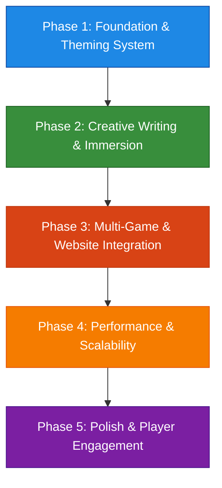

# 5-Phase Roadmap: Massive Writing & Text Improvement

## Overview
This roadmap outlines a **5-phase plan** to **massively improve the writing and text** across the **entire website and all games** in the ScaryGamesAI repository. The goal is to create a **dynamic, immersive, and terrifying** experience that adapts to **different themes** (e.g., pirate, cosmic horror, psychological horror) while ensuring **creativity, unpredictability, and scalability**.

### Key Objectives
- **Dynamic Theme Adaptability**: Real-time switching between themes (e.g., pirate, cosmic horror, psychological horror).
- **Creativity & Unpredictability**: LLM-powered text generation for fresh, engaging, and immersive experiences.
- **Scary Theme**: A mix of **gore, jump scares, psychological horror, and cosmic horror** tailored to each game.
- **Multi-Game & Website Support**: Improvements that apply to **all games** and the **entire website**.
- **Performance & Scalability**: Optimized for real-time generation and large player bases.

### Roadmap Workflow

---

## Phase 1: Foundation & Theming System

### Objective
Lay the **technical and creative foundation** for a **dynamic theming system** that supports **real-time theme switching** and **LLM-powered text generation**.

### Key Deliverables
1. **Dynamic Theming System**
   - Design a **theme engine** that supports real-time switching between themes (e.g., pirate, cosmic horror, psychological horror).
   - Define **theme-specific tone, vocabulary, and style guidelines** (e.g., pirate: "Arrr!", cosmic horror: "The void whispers your name....")
   - Integrate with the existing [`theme-system.js`](js/theme-system.js) for UI theming.

2. **Unified Writing Framework**
   - Create a **centralized writing framework** for games and website text.
   - Define **content types** (e.g., dialogue, lore, quests, UI text, tooltips).
   - Design **JSON-based templates** for theme-specific writing.

3. **LLM Integration**
   - Integrate **LLM-powered text generation** (e.g., Ollama, GPT) for dynamic content.
   - Create **prompt templates** for different themes and content types.
   - Implement **fallback mechanisms** for offline or low-latency scenarios.

4. **Theme-Specific Assets**
   - Define **theme-specific assets** (e.g., pirate: treasure maps, cosmic horror: eldritch symbols).
   - Create **theme-adaptive UI components** (e.g., buttons, menus, tooltips).

### Technical Implementation
- **Theme Engine**:
  - Design a `ThemeManager` class to handle theme switching and content adaptation.
  - Use **JSON configurations** to define theme-specific writing styles and vocabulary.
  - Integrate with [`theme-system.js`](js/theme-system.js) for UI theming.

- **Writing Framework**:
  - Create a `WritingSystem` class to manage content generation and adaptation.
  - Define **content templates** for dialogue, lore, quests, and UI text.
  - Use **LLM APIs** (e.g., Ollama) for dynamic text generation.

- **LLM Integration**:
  - Implement **prompt engineering** for theme-specific content.
  - Design **caching mechanisms** for frequently used text.
  - Create **fallback templates** for offline or low-latency scenarios.

### Success Metrics
- **Theme Switching**: Real-time theme switching with <500ms latency.
- **Content Coverage**: 100% of UI and narrative text supports dynamic theming.
- **LLM Performance**: Text generation latency <1s for 90% of requests.
- **Theme Consistency**: 95% adherence to theme-specific tone and vocabulary.

---

## Phase 2: Creative Writing & Immersion

### Objective
Develop **LLM-powered writing systems** that deliver **creative, unpredictable, and immersive** experiences tailored to each theme.

### Key Deliverables
1. **LLM-Powered Dialogue Systems**
   - Enhance the existing [`dialogue-system.js`](games/caribbean-conquest/systems/dialogue-system.js) with **LLM-powered NPC dialogue**.
   - Implement **personality and memory systems** for NPCs.
   - Create **theme-adaptive dialogue** (e.g., pirate: "Yer gold or yer life!", cosmic horror: "The stars hunger for your soul....")

2. **Procedural Lore & Quests**
   - Develop **procedural lore generation** for dynamic world-building.
   - Implement **quest generation** with branching narratives and player choices.
   - Create **theme-specific quest templates** (e.g., pirate: treasure hunts, cosmic horror: eldritch rituals).

3. **Scary Theme Variations**
   - Design **gore and jump scare** writing for horror games.
   - Create **psychological horror** narratives (e.g., unreliable narrators, gaslighting).
   - Develop **cosmic horror** themes (e.g., eldritch entities, existential dread).

4. **Theme-Adaptive UI & Tooltips**
   - Implement **theme-adaptive UI text** (e.g., buttons, menus, tooltips).
   - Create **dynamic tooltips** that adapt to the current theme.

### Technical Implementation
- **Dialogue Systems**:
  - Enhance [`dialogue-system.js`](games/caribbean-conquest/systems/dialogue-system.js) with **LLM-powered dialogue generation**.
  - Implement **personality traits** and **memory systems** for NPCs.
  - Use **prompt engineering** to generate theme-specific dialogue.

- **Procedural Lore & Quests**:
  - Design **quest templates** for different themes and gameplay styles.
  - Implement **branching narratives** with player choices and consequences.
  - Use **LLM APIs** to generate dynamic lore and quests.

- **Scary Themes**:
  - Create **theme-specific writing guidelines** for gore, psychological horror, and cosmic horror.
  - Implement **dynamic scare triggers** (e.g., jump scares, unsettling descriptions).
  - Use **LLM-generated text** to create unpredictable and immersive horror experiences.

- **UI & Tooltips**:
  - Integrate **theme-adaptive text** into UI components.
  - Use **dynamic tooltips** to provide context-sensitive information.

### Success Metrics
- **Dialogue Quality**: 90% of players find NPC dialogue immersive and engaging.
- **Quest Variety**: 50+ unique quests per theme.
- **Scary Theme Engagement**: 80% of players report feeling scared or unsettled.
- **UI Adaptability**: 100% of UI text adapts to the current theme.

---

## Phase 3: Multi-Game & Website Integration

### Objective
Apply the **writing and theming systems** to **all games** and the **entire website** to ensure a **consistent and immersive** experience.

### Key Deliverables
1. **Multi-Game Support**
   - Integrate the **writing and theming systems** into all games (e.g., Caribbean Conquest, Haunted Asylum, The Elevator).
   - Create **game-specific theme adaptations** (e.g., pirate for Caribbean Conquest, cosmic horror for Haunted Asylum).
   - Implement **cross-game lore and narrative consistency**.

2. **Website Integration**
   - Apply **theme-adaptive text** to the entire website (e.g., descriptions, menus, tooltips).
   - Create **dynamic landing pages** that adapt to the selected theme.
   - Implement **theme-specific marketing copy** for games and features.

3. **Player-Driven Storytelling**
   - Develop **player choice systems** that impact narratives across games.
   - Implement **consequence tracking** for player actions.
   - Create **persistent player legacies** that carry over between games.

4. **Cross-Game Lore**
   - Design a **unified lore system** that connects all games.
   - Implement **shared characters and factions** across games.
   - Create **cross-game events** that impact multiple games.

### Technical Implementation
- **Multi-Game Support**:
  - Integrate the `ThemeManager` and `WritingSystem` into all games.
  - Create **game-specific theme configurations** (e.g., pirate for Caribbean Conquest, cosmic horror for Haunted Asylum).
  - Implement **cross-game narrative systems** for shared lore and events.

- **Website Integration**:
  - Apply **theme-adaptive text** to all website pages (e.g., `index.html`, `games.html`).
  - Use **dynamic content generation** for landing pages and marketing copy.
  - Integrate **theme switching** into the website UI.

- **Player-Driven Storytelling**:
  - Design **player choice systems** with branching narratives.
  - Implement **consequence tracking** for player actions.
  - Create **persistent player legacies** that carry over between games.

- **Cross-Game Lore**:
  - Develop a **unified lore database** for shared characters and factions.
  - Implement **cross-game events** that impact multiple games.

### Success Metrics
- **Game Coverage**: 100% of games support dynamic theming and writing.
- **Website Adaptability**: 100% of website text adapts to the selected theme.
- **Player Engagement**: 70% of players engage with cross-game narratives.
- **Lore Consistency**: 90% of players find cross-game lore cohesive and immersive.

---

## Phase 4: Performance & Scalability

### Objective
Optimize the **writing and theming systems** for **real-time performance, low latency, and scalability** to support large player bases.

### Key Deliverables
1. **LLM Performance Optimization**
   - Reduce **text generation latency** for real-time interactions.
   - Implement **caching mechanisms** for frequently used text.
   - Optimize **prompt engineering** for faster LLM responses.

2. **Theme Switching Performance**
   - Ensure **low-latency theme switching** across games and website.
   - Optimize **asset loading** for theme-specific content.
   - Implement **pre-loading** for theme assets.

3. **Scalability Testing**
   - Test **scalability** for large player bases (e.g., 10,000+ concurrent players).
   - Optimize **server-side text generation** for multiplayer games.
   - Implement **load balancing** for LLM API requests.

4. **Offline & Low-Latency Support**
   - Create **fallback mechanisms** for offline or low-latency scenarios.
   - Implement **local text generation** for single-player games.
   - Design **offline caching** for static content.

### Technical Implementation
- **LLM Performance**:
  - Optimize **prompt engineering** for faster LLM responses.
  - Implement **caching mechanisms** for frequently used text.
  - Use **edge computing** for low-latency text generation.

- **Theme Switching**:
  - Optimize **asset loading** for theme-specific content.
  - Implement **pre-loading** for theme assets.
  - Ensure **low-latency theme switching** (<200ms).

- **Scalability**:
  - Test **scalability** for large player bases (e.g., 10,000+ concurrent players).
  - Optimize **server-side text generation** for multiplayer games.
  - Implement **load balancing** for LLM API requests.

- **Offline Support**:
  - Create **fallback templates** for offline or low-latency scenarios.
  - Implement **local text generation** for single-player games.
  - Design **offline caching** for static content.

### Success Metrics
- **Text Generation Latency**: <500ms for 95% of requests.
- **Theme Switching Latency**: <200ms for 100% of switches.
- **Scalability**: Support 10,000+ concurrent players with <1s latency.
- **Offline Support**: 100% of games and website text available offline.

---

## Phase 5: Polish & Player Engagement

### Objective
Refine the **writing and theming systems** based on **player feedback** and **A/B testing**, while adding **accessibility features** and **community-driven content**.

### Key Deliverables
1. **Player Feedback & Iteration**
   - Gather **player feedback** on writing quality, immersion, and theme adaptability.
   - Implement **A/B testing** for narrative and UI text.
   - Refine **theme-specific writing** based on feedback.

2. **Accessibility Features**
   - Add **dyslexia-friendly fonts** and **screen reader support**.
   - Implement **text scaling** and **high-contrast modes**.
   - Create **audio descriptions** for key narrative moments.

3. **Community-Driven Content**
   - Develop **modding tools** for player-generated stories and quests.
   - Implement **community-driven lore** (e.g., player-submitted stories, rumors).
   - Create **player-generated content contests** with rewards.

4. **Final Polish**
   - Fix **bugs and inconsistencies** in writing and theming systems.
   - Optimize **performance and scalability** based on player feedback.
   - Ensure **cross-platform compatibility** (e.g., PC, mobile, console).

### Technical Implementation
- **Player Feedback**:
  - Implement **feedback tools** (e.g., surveys, ratings) for writing and theming.
  - Use **A/B testing** to compare narrative and UI text variations.
  - Refine **theme-specific writing** based on feedback.

- **Accessibility**:
  - Add **dyslexia-friendly fonts** (e.g., OpenDyslexic).
  - Implement **screen reader support** (e.g., ARIA labels, text-to-speech).
  - Create **audio descriptions** for key narrative moments.

- **Community-Driven Content**:
  - Develop **modding tools** for player-generated stories and quests.
  - Implement **community-driven lore** (e.g., player-submitted stories, rumors).
  - Create **player-generated content contests** with rewards.

- **Final Polish**:
  - Fix **bugs and inconsistencies** in writing and theming systems.
  - Optimize **performance and scalability** based on player feedback.
  - Ensure **cross-platform compatibility** (e.g., PC, mobile, console).

### Success Metrics
- **Player Satisfaction**: 90% of players report high satisfaction with writing and theming.
- **Accessibility Compliance**: 100% WCAG 2.2 AA compliance.
- **Community Engagement**: 500+ player-generated stories or mods submitted.
- **Bug-Free Experience**: <1 critical bug per 10,000 players.

---

## Conclusion
This **5-phase roadmap** provides a **comprehensive plan** to **massively improve the writing and text** across the **entire website and all games**. By leveraging **dynamic theming, LLM-powered creativity, and player-driven storytelling**, we will create a **terrifying, immersive, and unforgettable** experience for players.

### Next Steps
1. **Review and Refine**: Gather feedback from stakeholders and players.
2. **Prioritize Phases**: Adjust phase order based on business and player needs.
3. **Create Implementation Plan**: Break down each phase into actionable tasks.
4. **Switch to Code Mode**: Begin implementation starting with **Phase 1**.{
