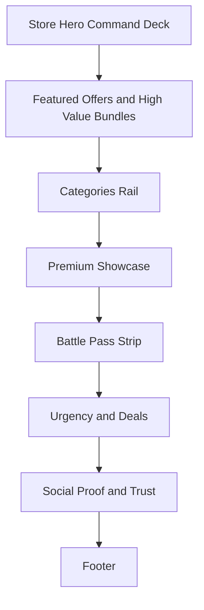

# ScaryGamesAI Store Premium Redesign Specification

## Objective
Redesign the marketing layer of the in-game shop landing page to feel premium, supreme, and high-conversion while preserving horror tone and compatibility with existing runtime store flow.

## Non-Negotiable Constraints
- Do not change JavaScript store logic or the dynamic modal/store window behavior driven by `ScaryStore.openStore(tab)`.
- Keep compatibility with existing font stack (`Creepster`, `Nosifer`, `Inter`) already defined in base tokens.
- Preserve all current click entry points that call `ScaryStore.openStore(...)` from the landing page.
- This spec covers `store.html` structure refinement and `css/store.css` visual system redesign only.

---

## 1) IA + Section-by-Section Layout Plan

### Final section order on `store.html`
1. Hero command deck
2. Featured Offers + High-Value Bundles (dominant first module)
3. Categories rail
4. Premium Showcase gallery
5. Battle Pass strip
6. Urgency and deals command bar
7. Social proof + trust metrics
8. Footer

### A. Hero command deck
Purpose: immediate premium impact + prime CTA to open store.

Content blocks:
- Eyebrow: "The Forbidden Market"
- Headline: high-contrast horror premium statement
- Subcopy: one sentence value prop
- Primary CTA: `Open Store` -> `ScaryStore.openStore('featured')`
- Secondary CTA: `View Bundles` -> `ScaryStore.openStore('bundles')`
- Utility chips: "100+ Cosmetics", "Live Deals", "Premium Pass"

Layout:
- Desktop: 2-column asymmetrical (left copy, right floating premium card cluster)
- Tablet/mobile: stacked, CTA pair at top of fold

### B. Featured Offers + High-Value Bundles (dominant)
Purpose: first monetization module after hero per stakeholder priority.

Content blocks:
- Section title + short subtitle
- 1 hero featured card (2x width) for highest-value bundle
- 3 supporting offer cards
- Each card includes rarity, value delta, strike-through original, current price, and CTA

CTA mapping:
- Hero card CTA -> `ScaryStore.openStore('bundles')`
- Supporting cards -> either `bundles` or `featured` based on card type

### C. Categories rail
Purpose: fast route selection for user intent.

Categories:
- Battle Pass
- Skins
- Effects
- Bundles
- Currency
- Gifts

Behavior:
- Pill buttons with icon + label
- Hover lift + glow
- Click maps exactly to existing tabs via `ScaryStore.openStore('<tab>')`

### D. Premium Showcase gallery
Purpose: demonstrate aspirational value.

Content blocks:
- 4–6 premium cosmetics cards
- Rarity tags (Epic, Legendary, Mythic)
- Micro lore copy line
- Preview CTA -> `ScaryStore.openStore('featured')` or relevant category

Layout:
- Desktop: 3-column staggered masonry-like rhythm (implemented via controlled row spans or varied card heights)
- Tablet: 2-column
- Mobile: 1-column carousel-like horizontal scroll or stacked cards

### E. Battle Pass strip
Purpose: showcase pass without stealing top priority from bundles.

Content blocks:
- Left: season emblem + pass name + value bullets
- Center: reward snapshots tiers 25/50/75/100
- Right: CTA group
  - `View Pass` -> `ScaryStore.openStore('battlepass')`
  - `Open Store` -> `ScaryStore.openStore('featured')`

Visual:
- Frost/cyan accent blended into blood-red horror base to preserve brand + seasonal vibe.

### F. Urgency + deals command bar
Purpose: trigger action through scarcity while staying premium.

Content blocks:
- Countdown module (static placeholder on landing; actual timer visuals style-led)
- Flash deal cards (2-3)
- One dominant CTA: `Claim Deals` -> `ScaryStore.openStore('featured')`

### G. Social proof + trust metrics
Purpose: confidence and prestige.

Content blocks:
- Numeric stats row (cosmetics count, active buyers, premium owners, avg rating)
- Quote carousel style cards (static content initially)
- Security/trust chips: "Secure checkout", "Instant unlock", "Cross-game cosmetic support"

---

## 2) Exact Visual Direction for `css/store.css`

### A. Color layering
Use layered darkness with controlled premium accents:
- Base 0: #050508
- Base 1: #0b0b12
- Base 2: #12121a
- Elevated card: rgba(18,18,28,0.82)
- Elevated hover: rgba(26,26,38,0.92)

Accent hierarchy:
- Primary horror premium: crimson (`--accent-red`)
- Premium energy: violet (`--accent-purple`)
- Deal urgency: ember/orange
- Seasonal pass accent: icy cyan used sparingly in pass strip only

### B. Gradient system
- Page backdrop: layered radial + linear stack, very low alpha noise/fog texture
- Premium cards: diagonal dual-tone gradients at 8–18% alpha
- CTA gradients:
  - Primary: crimson -> bright crimson
  - Premium: crimson -> violet
  - Deal: ember -> red

### C. Glow system (3 tiers)
- Glow-1 subtle: 0 0 14px rgba(204,17,34,0.20)
- Glow-2 interactive: 0 0 24px rgba(204,17,34,0.35)
- Glow-3 premium spotlight: 0 0 44px rgba(168,85,247,0.35)

Rule:
- Idle elements use Glow-1 or none
- Hover/focus use Glow-2
- Only one hero element per viewport can use Glow-3 to avoid visual noise

### D. Card depth and surface language
- Base card: 1px inner border + soft outer shadow
- Featured card: double-depth effect with pseudo-element halo
- Hover motion: translateY(-4px) + slight scale (1.01 max)
- Preserve readable contrast ratio for text and prices

### E. Typography hierarchy using current fonts
- H1 hero: `var(--font-logo)` or `var(--font-display)` (use one consistently)
- Section headers: `var(--font-display)`
- Card title/body/meta: `var(--font-body)`

Scale:
- Display: clamp(2.4rem, 5vw, 4.2rem)
- Section title: clamp(1.4rem, 2.4vw, 2.2rem)
- Card title: 1.05rem to 1.25rem
- Meta labels: 0.72rem to 0.84rem uppercase + letter spacing

### F. Spacing rhythm
Adopt 8pt rhythm:
- Micro: 8
- Small: 16
- Medium: 24
- Large: 40
- XL section: 72 to 96

Section paddings:
- Hero top offset respects nav
- Primary modules: 64 to 88 vertical desktop
- Mobile reduced to 36 to 48

### G. Animation strategy
Use premium restraint:
- Entry fades with 12–24px upward drift
- Hover transitions: 220ms to 280ms ease-out
- CTA pulse: very subtle, 2.8s cycle, max scale delta 1.02
- Shimmer reserved only for top featured offer edge
- Respect reduced motion media query by disabling non-essential motion

---

## 3) Responsive Behavior Specification

### Desktop >= 1200
- Hero 2-column cinematic layout
- Featured module: 12-col grid (hero card spans 6-7 cols)
- Categories: full horizontal rail
- Premium gallery: 3 columns
- Battle pass strip: horizontal tri-panel

### Tablet 768-1199
- Hero stacked split with reduced ornamentation
- Featured: 2-column cards with hero card full width
- Categories: horizontal scroll rail
- Premium gallery: 2 columns
- Battle pass strip: stacked left/right actions under reward preview

### Mobile <= 767
- Hero compact with persistent primary CTA near top
- Featured cards: single-column snap stack
- Categories: scrollable pills with visible active state
- Premium showcase: 1-column or horizontal card track
- Deal bar: timer top, deal cards below, full-width CTA
- Maintain minimum touch target sizes and high text contrast

---

## 4) Component Mapping Guidance for Immediate Implementation

### `store.html` structural guidance
- Replace inline styles with semantic section classes in `css/store.css`.
- Keep IDs and click handlers required for flow:
  - `#open-store-btn`
  - category and CTA buttons using `ScaryStore.openStore('<tab>')`
- Keep existing script includes and page shell behavior unchanged.

Suggested class architecture:
- `.store-hero-premium`
- `.store-featured-grid`
- `.store-category-rail`
- `.store-premium-showcase`
- `.store-battlepass-strip`
- `.store-urgency-bar`
- `.store-social-proof`

### `css/store.css` refactor strategy
- Reuse existing tokens where possible; add scoped store tokens only when needed.
- Consolidate redundant legacy store selectors.
- Create explicit layer blocks:
  - `/* TOKENS */`
  - `/* LAYOUT */`
  - `/* COMPONENTS */`
  - `/* STATES */`
  - `/* RESPONSIVE */`

---

## 5) Implementation Checklist for Code Specialist

1. Replace inline style attributes in `store.html` with semantic classes only.
2. Implement new section order and wrappers per this spec.
3. Keep all existing `ScaryStore.openStore(tab)` trigger mappings functional.
4. Build featured-first module directly after hero with one dominant bundle card.
5. Add category rail buttons mapped to exact existing tabs.
6. Implement premium showcase cards with rarity and value hierarchy.
7. Implement battle pass strip as secondary monetization module.
8. Add urgency/deals strip with visual countdown treatment.
9. Add social proof metrics and trust chips module.
10. Refactor `css/store.css` into tokenized, layered architecture.
11. Implement glow tiers, card depth, and constrained motion rules.
12. Add responsive breakpoints and verify layout behavior at desktop/tablet/mobile.
13. Validate accessibility: focus states, contrast, reduced motion, touch targets.
14. Validate compatibility: open `store.html`, click each CTA, confirm proper tab opens in store modal.

---

## 6) Compatibility Contract with Existing Open Store Flow

Required compatibility guarantees:
- No API contract changes.
- No modifications to `ScaryStore` object methods.
- No changes to tab names used in `openStore`: `featured`, `battlepass`, `skins`, `effects`, `bundles`, `currency`, `gifts`.
- Keep `#open-store-btn` event path intact.

---

## 7) Visual Priority Summary

Priority order is now:
1. Featured Offers + high-value Bundles
2. Battle Pass
3. Other categories and supporting commerce modules

This ensures first-scroll conversion emphasis aligns with requested business priority while preserving the horror premium identity.

---

## Mermaid: High-Level Layout Flow



## Mermaid: CTA Routing Contract

```mermaid
flowchart LR
    A[Primary Open Store CTA] --> B[openStore featured]
    C[Bundles CTA] --> D[openStore bundles]
    E[Battle Pass CTA] --> F[openStore battlepass]
    G[Category Pills] --> H[openStore tab specific]